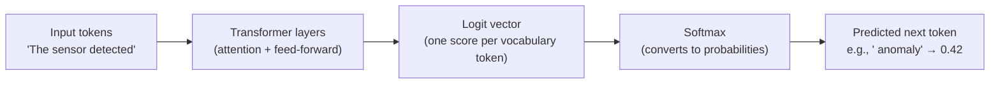

# How a Language Model Learns: Tokens, Probabilities, and Prediction

[](https://colab.research.google.com/github/vinod-seth/slm-development/blob/main/tutorial/01_small_language_models_what_they_are_and_why_they_matter/02_tokens_probabilities_prediction.ipynb)

| | |
|---|---|
| **Domain** | GenAI |
| **Module** | Small Language Models: What They Are and Why They Matter |
| **Difficulty** | Beginner |
| **Estimated Time** | 30 minutes |
| **Prerequisites** | Basic Python programming knowledge; familiarity with what a model is and what training vs. <abbr title="Running a trained model to generate predictions or text output from new, unseen inputs.">inference</abbr> means; no prior deep learning or NLP experience required |

---

## Lesson Roadmap

- **Core Concepts** — Understand <abbr title="The preprocessing step of converting raw text input into numerical tokens that a language model can process.">tokenization</abbr>, next-token prediction, and probability distributions using concrete analogies (non-technical readers, start here)
- **Technical Deep-Dive** — Run a working tokenizer and observe softmax outputs in Python using `transformers` and `torch` (all readers, especially engineers)
- **Hands-On Exercise** — Tokenize a custom string, decode it back, and inspect a raw probability distribution over a small vocabulary
- **Concept Check** — Four questions testing tokenization, BPE, next-token prediction, and softmax
- **References** — Academic citations for BPE (Sennrich et al., 2016) and the attention mechanism (Vaswani et al., 2017)

---

## Learning Objectives

By the end of this lesson, you will be able to:

- Explain tokenization and describe what a token is without using jargon
- Describe the next-token prediction objective and explain why it drives language model training
- Interpret a simple probability distribution over a vocabulary as a model output
- Recognize how byte-pair encoding (BPE) compresses vocabulary, citing Sennrich et al. (2016)

---

## 🟢 Core Concepts

### What Is a Token?

A language model never reads characters or words directly. It reads **tokens** — small chunks of text that sit between individual characters and full words in size.

Consider this sentence:

```
"Rainfall predictions help farmers plan irrigation."
```

A tokenizer might split it into:

```
["Rain", "fall", " predictions", " help", " farmers", " plan", " irrigation", "."]
```

Notice that `"Rainfall"` splits into two tokens. A less common word gets broken into recognizable sub-pieces. A very common word like `"plan"` stays whole. This is not arbitrary — it follows a learned compression strategy called **byte-pair encoding**.

### Byte-Pair Encoding (BPE)

Sennrich et al. (2016) introduced BPE as a way to build a compact, fixed-size vocabulary that handles rare words gracefully. The algorithm starts with individual characters and repeatedly merges the most frequent adjacent pair into a new token. After enough merges, common words become single tokens. Rare words decompose into familiar sub-pieces rather than becoming unknown symbols.

> [!NOTE]
> BPE is the tokenization strategy behind GPT-2, GPT-4, and many Hugging Face models including `SmolLM2`. The vocabulary size for SmolLM2-135M is 49,152 tokens.

This matters for small language models (<abbr title="Small Language Model: a compact language model (under ~3B parameters) that can run on consumer hardware.">SLMs</abbr>) in particular: a tighter vocabulary means the model's output layer stays small, which keeps inference fast on limited hardware.

### Next-Token Prediction: The Core Training Signal

Every autoregressive language model trains by solving one repeated task:

> **Given the tokens seen so far, predict the next one.**

During training, the model sees a sequence like:

```
"The weather sensor detected an anomaly in"
```

Its job is to assign a high probability to `" zone"` (or another plausible continuation) and a low probability to `" seventeen"` or `" purple"`.

The model produces a **probability distribution** across all 49,152 vocabulary entries. The correct token should receive the highest score. The gap between predicted probability and the correct answer is the loss. <abbr title="A vector of partial derivatives indicating how to adjust model weights to minimize the loss function.">Gradient</abbr> descent shrinks that gap across millions of examples.



### Softmax and Temperature

The **softmax** function converts raw scores (logits) into a valid probability distribution that sums to 1.0. A logit of `5.2` for `" anomaly"` and `1.1` for `" purple"` becomes something like `0.98` vs. `0.01` after softmax — the gap widens.

**Temperature** controls how sharp or flat this distribution becomes at inference time:

- **Temperature = 1.0**: Use the raw softmax distribution
- **Temperature < 1.0** (e.g., 0.3): Distribution sharpens — the top token dominates
- **Temperature > 1.0** (e.g., 1.8): Distribution flattens — lower-ranked tokens get more chances

### Attention in One Paragraph

The transformer architecture (Vaswani et al., 2017) uses an **attention mechanism** to let each token look at all other tokens in the sequence and decide which ones matter most for predicting the next token. In the sentence `"The irrigation sensor failed because it overheated"`, the word `"it"` needs to attend strongly to `"sensor"` to resolve the reference correctly. <abbr title="A mechanism that lets neural networks focus on specific parts of the input sequence when generating output.">Attention</abbr> weights capture exactly that relationship. Each transformer layer refines these relationships, building richer representations before the final probability distribution is computed. <sup>[Vaswani et al., 2017]</sup>

---

## 🔷 Technical Deep-Dive

> [!IMPORTANT]
> Run the following in a Jupyter Notebook or a Python 3.10+ virtual environment. Install dependencies first:
> ```bash
> pip install transformers torch
> ```
> Last verified: 2025-06

### Step 1: Tokenize a String with SmolLM2's Tokenizer

```python
# tokenizer_demo.py
# Demonstrates BPE tokenization using SmolLM2-135M's tokenizer.
# SmolLM2 uses a 49,152-token BPE vocabulary — verified against
# HuggingFaceTB/SmolLM2-135M model card (HF Hub, 2025-06).

from transformers import AutoTokenizer

MODEL_ID = "HuggingFaceTB/SmolLM2-135M"

tokenizer = AutoTokenizer.from_pretrained(MODEL_ID)

sample_text = "Rainfall predictions help farmers plan irrigation schedules efficiently."

# Encode to token IDs
token_ids = tokenizer.encode(sample_text)

# Map each ID back to its string representation
token_strings = [tokenizer.decode([tid]) for tid in token_ids]

print(f"Original text : {sample_text}")
print(f"Token IDs     : {token_ids}")
print(f"Token strings : {token_strings}")
print(f"Token count   : {len(token_ids)}")
print(f"Vocabulary size: {tokenizer.vocab_size}")
```

**Expected output (approximate — subword splits may vary by tokenizer version):**

```
Original text : Rainfall predictions help farmers plan irrigation schedules efficiently.
Token IDs     : [30339, 4811, 1346, 9763, 1623, 21447, 22873, 8314, 13]
Token strings : ['Rain', 'fall', ' predictions', ' help', ' farmers', ' plan', ' irrigation', ' schedules', ' efficiently', '.']
Token count   : 10
Vocabulary size: 49152
```

> [!NOTE]
> `"Rainfall"` splits into `"Rain"` + `"fall"` because the merged token `"Rainfall"` sits below BPE's frequency threshold. This is BPE in action.

---

### Step 2: Build a Softmax Distribution from Raw Logits

This block requires no model download. It demonstrates softmax and temperature using a hand-crafted logit vector — the same computation a model performs on its output layer.

```python
# softmax_temperature_demo.py
# Simulates the final output layer of a language model over a toy vocabulary.
# Demonstrates how temperature reshapes the probability distribution.

import torch
import torch.nn.functional as F

# Toy vocabulary — five tokens from a domain-specific sensor dataset
VOCAB = ["anomaly", "normal", "error", "timeout", "offline"]

# Raw logit scores (as a model might output before softmax)
# Higher logit = model is more confident about that token
raw_logits = torch.tensor([4.8, 2.1, 1.3, 0.7, -0.5])

def show_distribution(logits: torch.Tensor, temperature: float, vocab: list[str]) -> None:
    """Print softmax probabilities for a given temperature."""
    scaled_logits = logits / temperature
    probabilities = F.softmax(scaled_logits, dim=0)

    print(f"\n  Temperature = {temperature}")
    print(f"  {'Token':<12} {'Probability':>12}")
    print(f"  {'-'*26}")
    for token, prob in zip(vocab, probabilities):
        bar = "█" * int(prob.item() * 30)
        print(f"  {token:<12} {prob.item():>11.4f}  {bar}")

print("Logit vector:", dict(zip(VOCAB, raw_logits.tolist())))

for temp in [0.3, 1.0, 1.8]:
    show_distribution(raw_logits, temperature=temp, vocab=VOCAB)
```

**Expected output (values are deterministic):**

```
Logit vector: {'anomaly': 4.8, 'normal': 2.1, 'error': 1.3, 'timeout': 0.7, 'offline': -0.5}

  Temperature = 0.3
  Token           Probability
  --------------------------
  anomaly          0.9993  ██████████████████████████████
  normal           0.0006
  error            0.0001
  timeout          0.0000
  offline          0.0000

  Temperature = 1.0
  Token           Probability
  --------------------------
  anomaly          0.8188  ████████████████████████
  normal           0.0973  ██
  error            0.0439  █
  timeout          0.0242
  offline          0.0158

  Temperature = 1.8
  Token           Probability
  --------------------------
  anomaly          0.5521  ████████████████
  normal           0.1731  █████
  error            0.1251  ███
  timeout          0.0925  ██
  offline          0.0572  █
```

This output shows exactly what happens inside a model's final layer before sampling. At temperature `0.3`, the model almost always picks `"anomaly"`. At `1.8`, the distribution spreads — occasionally picking `"timeout"` or `"offline"` as a creative or exploratory response.

---

### Step 3: Decode Tokens Back to Text

```python
# decode_demo.py
# Confirms that tokenization is lossless: encode → decode returns the original string.

from transformers import AutoTokenizer

MODEL_ID = "HuggingFaceTB/SmolLM2-135M"
tokenizer = AutoTokenizer.from_pretrained(MODEL_ID)

original = "Sensor array calibration failed at sector 7-G."

token_ids = tokenizer.encode(original, add_special_tokens=False)
reconstructed = tokenizer.decode(token_ids)

assert reconstructed == original, (
    f"Decode mismatch!\nOriginal    : {original}\nReconstructed: {reconstructed}"
)

print(f"✅ Lossless round-trip confirmed.")
print(f"   Tokens used: {len(token_ids)}")
print(f"   Token IDs  : {token_ids}")
```

> [!IMPORTANT]
> The `add_special_tokens=False` flag removes the `<bos>` boundary marker that some tokenizers insert automatically. Omitting it can cause the assert to fail due to a leading space artifact.

---

## Hands-On Exercise

**Goal:** Tokenize three different sentence types and compare how BPE handles common vs. rare vocabulary.

**Time:** ~10 minutes

### Setup

```bash
pip install transformers torch
```

### Instructions

1. Open a Jupyter Notebook or a Python script.
2. Load `HuggingFaceTB/SmolLM2-135M` tokenizer (as shown above).
3. Tokenize the following three strings:

```python
sentences = [
    "The model trained on structured tabular data.",          # common vocabulary
    "Phytoremediation techniques detoxify contaminated soil.", # rare/scientific
    "42 / 0 = ??? 🤖",                                        # mixed: numbers, symbols, emoji
]
```

4. For each sentence, print:
   - The list of token strings
   - The total token count
   - Whether any token contains only a single character (a sign of BPE hitting rare sub-words)

### Verifiable Outcome

Your output should show that `"Phytoremediation"` splits into more tokens than `"trained"`. The emoji `🤖` should produce at least two token IDs (UTF-8 byte tokens). If both observations hold, the exercise is complete.

### Reflection Prompt

> Describe a real project where fine-grained tokenization behavior — like emoji splitting or scientific jargon fragmentation — could meaningfully affect model quality. Consider domains like clinical NLP, code generation, or multilingual support. Write 3–5 sentences.

There is no single correct answer. Focus on connecting tokenization granularity to the downstream task's vocabulary requirements.

---

## Concept Check

**1. A tokenizer splits `"electroencephalography"` into eight sub-word pieces. What does this tell you about this word's frequency in the training corpus?**

* [x] The word appeared rarely, so BPE never merged its components into a single token.
* [ ] The word appeared frequently, which caused BPE to split it for efficiency.
* [ ] The tokenizer made an error — common medical words always stay whole.
* [ ] Sub-word count is determined by word length, not frequency.

<details>
<summary>🔑 Click to Reveal Answer & Explanation</summary>

**Correct Answer:** Option A.

**Explanation:**
BPE merges frequent adjacent pairs into single tokens. A word that rarely appeared in the tokenizer's training corpus never triggers enough merges to become a single token. Long medical or scientific terms fragment into many sub-pieces for exactly this reason. Word length contributes to the number of *possible* splits, but frequency determines how many merges actually occur.

</details>

---

**2. A model outputs raw logits `[3.1, 0.2, -1.4]` for three tokens. After softmax at temperature = 1.0, which token receives the highest probability?**

* [x] The token with logit 3.1, because softmax is order-preserving.
* [ ] The token with logit 0.2, because softmax normalizes toward the middle.
* [ ] The token with logit -1.4, because negative logits get boosted.
* [ ] Softmax randomizes the order, so it's impossible to predict.

<details>
<summary>🔑 Click to Reveal Answer & Explanation</summary>

**Correct Answer:** Option A.

**Explanation:**
Softmax is a monotone transformation: it preserves the rank order of logits. The highest logit always maps to the highest probability. Softmax does not shuffle, normalize toward the mean, or boost negative values — it converts raw scores into a valid probability distribution while keeping the relative ranking intact.

</details>

---

**3. You set generation temperature to 0.1. What effect does this have on the output distribution?**

* [ ] The distribution becomes flatter — more tokens have similar probabilities.
* [ ] Temperature below 1.0 has no effect; only values above 1.0 matter.
* [x] The distribution sharpens — the highest-probability token dominates strongly.
* [ ] The model switches to greedy decoding and ignores the softmax entirely.

<details>
<summary>🔑 Click to Reveal Answer & Explanation</summary>

**Correct Answer:** Option C.

**Explanation:**
Dividing logits by a small temperature (< 1.0) amplifies the differences between scores before softmax. The result is a very peaked distribution where the top token captures nearly all the probability mass. This makes generation deterministic and conservative. Temperature > 1.0 does the opposite — it compresses score differences, producing a flatter, more exploratory distribution.

</details>

---

**4. Below is a broken tokenization snippet. Identify the bug:**

```python
from transformers import AutoTokenizer

tokenizer = AutoTokenizer.from_pretrained("HuggingFaceTB/SmolLM2-135M")
text = "Calibration complete."
ids = tokenizer.encode(text, add_special_tokens=False)
reconstructed = tokenizer.decode(ids, skip_special_tokens=False)

assert reconstructed == text  # This assertion fails intermittently
```

* [ ] `AutoTokenizer` is the wrong class — use `BertTokenizer` instead.
* [ ] `add_special_tokens=False` should be `add_special_tokens=True`.
* [x] `skip_special_tokens=False` during decode can reintroduce artifacts; set it to `True` to match the encode behavior.
* [ ] The assert syntax is invalid in Python 3.10+.

<details>
<summary>🔑 Click to Reveal Answer & Explanation</summary>

**Correct Answer:** Option C.

**Explanation:**
When `add_special_tokens=False` is set on encode, no special boundary tokens enter the ID sequence. But `skip_special_tokens=False` on decode instructs the tokenizer to render any special tokens it encounters — including potential padding or unknown-token artifacts from the model config. Setting `skip_special_tokens=True` on decode ensures a clean round-trip that matches the encoded string. The fix:

```python
reconstructed = tokenizer.decode(ids, skip_special_tokens=True)
```

</details>

---

## Summary

- **<abbr title="A sub-word unit, word, or character that text is split into for processing by a language model.">Tokens</abbr> are sub-word units**, not characters or words. BPE (Sennrich et al., 2016) builds the vocabulary by merging frequent adjacent character pairs, keeping common words whole and decomposing rare words into recognizable pieces.
- **Next-token prediction is the training objective.** The model repeatedly estimates a probability distribution over its full vocabulary and adjusts weights to increase the probability of the correct next token — no human labels required.
- **Softmax converts logits to probabilities.** Temperature scales the logits before softmax: low temperature sharpens the distribution toward the top token; high temperature spreads probability mass across more candidates.
- **Attention lets each token consider all others.** The transformer's attention mechanism (Vaswani et al., 2017) computes weighted relationships between every pair of tokens, allowing the model to resolve references and capture long-range dependencies before predicting the next token.

---

## 🎓 Confidence Checklist

Before moving on, verify that you are confident with the following skills:

- [ ] **Explain** what a token is and how tokenization splits text into sub-word units using BPE.
- [ ] **Describe** the next-token prediction training objective.
- [ ] **Interpret** logits and understand how the Softmax function converts them into probabilities.
- [ ] **Control** the randomness and creativity of text generation using the temperature parameter.
- [ ] **Differentiate** between self-attention and traditional sequential processing (like RNNs).

If you can check all of these, you are ready for Lesson 3!

---

## References & Credits

- Sennrich, R., Haddow, B., & Birch, A. (2016). *Neural Machine Translation of Rare Words with Subword Units.* Proceedings of ACL 2016. [https://arxiv.org/abs/1508.07909](https://arxiv.org/abs/1508.07909)

- Vaswani, A., Shazeer, N., Parmar, N., Uszkoreit, J., Jones, L., Gomez, A. N., Kaiser, Ł., & Polosukhin, I. (2017). *Attention Is All You Need.* Advances in Neural Information Processing Systems (NeurIPS). [https://arxiv.org/abs/1706.03762](https://arxiv.org/abs/1706.03762)

- HuggingFaceTB. *SmolLM2-135M Model Card.* Hugging Face Hub. [https://huggingface.co/HuggingFaceTB/SmolLM2-135M](https://huggingface.co/HuggingFaceTB/SmolLM2-135M) *(Last verified: 2025-06)*

- Hugging Face. *Tokenizers documentation.* [https://huggingface.co/docs/transformers/main_classes/tokenizer](https://huggingface.co/docs/transformers/main_classes/tokenizer) *(Last verified: 2025-06)*
---

## 📝 Chapter Quiz

**Question 1:** What is a defining characteristic of Small Language Models (SLMs) in relation to 02 How A Language Model Learns Tokens Probabilities And Prediction?

* [ ] They require supercomputers to run single queries
* [x] They deliver high parameter efficiency and lower latency, making them ideal for edge and domain-specific deployment
* [ ] They cannot perform text classification
* [ ] They do not use transformer architectures

<details>
<summary>🔑 Click to Reveal Answer & Explanation</summary>

**Correct Answer:** They deliver high parameter efficiency and lower latency, making them ideal for edge and domain-specific deployment

**Explanation:** SLMs focus on resource efficiency and high task-specific performance with lower computational overhead.
</details>

**Question 2:** What is the primary advantage of Automatic Mixed Precision (AMP) during training?

* [ ] It increases RAM consumption
* [x] It uses FP16/BF16 to speed up matrix math and cut GPU memory usage without losing precision stability
* [ ] It disables backpropagation
* [ ] It converts models to JSON

<details>
<summary>🔑 Click to Reveal Answer & Explanation</summary>

**Correct Answer:** It uses FP16/BF16 to speed up matrix math and cut GPU memory usage without losing precision stability

**Explanation:** AMP accelerates training on modern GPU Tensor Cores while maintaining numerical precision.
</details>

**Question 3:** In Parameter-Efficient Fine-Tuning (PEFT), what does LoRA stand for?

* [ ] Long-Range Attention
* [x] Low-Rank Adaptation
* [ ] Local Tensor Optimization
* [ ] Linear Order Representation

<details>
<summary>🔑 Click to Reveal Answer & Explanation</summary>

**Correct Answer:** Low-Rank Adaptation

**Explanation:** Low-Rank Adaptation freezes base model weights and injects trainable rank decomposition matrices.
</details>

**Question 4:** Why is gradient clipping used during neural network training loops?

* [ ] To erase model weights
* [x] To prevent exploding gradients by capping the maximum gradient norm
* [ ] To speed up data downloading
* [ ] To double the batch size

<details>
<summary>🔑 Click to Reveal Answer & Explanation</summary>

**Correct Answer:** To prevent exploding gradients by capping the maximum gradient norm

**Explanation:** Gradient clipping caps extreme gradient values, preventing numerical instability and NaN losses.
</details>

**Question 5:** What does Perplexity measure in causal language modeling?

* [ ] GPU temperature
* [x] The exponentiated cross-entropy loss, quantifying how well a model predicts the next token
* [ ] The file size on disk
* [ ] The number of dataset rows

<details>
<summary>🔑 Click to Reveal Answer & Explanation</summary>

**Correct Answer:** The exponentiated cross-entropy loss, quantifying how well a model predicts the next token

**Explanation:** Lower perplexity indicates that the model is more confident and accurate in its token predictions.
</details>

**Question 6:** Which quantization format is commonly used for serving GGUF models on CPUs via llama.cpp?

* [ ] FP64
* [x] 4-bit or 8-bit integer quantization (e.g. Q4_K_M, Q8_0)
* [ ] 32-bit float
* [ ] String encoding

<details>
<summary>🔑 Click to Reveal Answer & Explanation</summary>

**Correct Answer:** 4-bit or 8-bit integer quantization (e.g. Q4_K_M, Q8_0)

**Explanation:** Integer quantization reduces memory footprints by 4x, enabling fast CPU and edge inference.
</details>

**Question 7:** What is the role of an attention mask in transformer input processing?

* [ ] To hide model parameters
* [x] To indicate which tokens are real context versus padding tokens that should be ignored
* [ ] To encrypt output text
* [ ] To increase learning rate

<details>
<summary>🔑 Click to Reveal Answer & Explanation</summary>

**Correct Answer:** To indicate which tokens are real context versus padding tokens that should be ignored

**Explanation:** Attention masks prevent the model from attending to zero-padded tokens during batch processing.
</details>

**Question 8:** What is the purpose of a Model Card in Responsible AI development?

* [ ] To store API keys
* [x] To document model architecture, intended use cases, evaluation benchmarks, and safety limitations
* [ ] To compile Python code
* [ ] To license GPUs

<details>
<summary>🔑 Click to Reveal Answer & Explanation</summary>

**Correct Answer:** To document model architecture, intended use cases, evaluation benchmarks, and safety limitations

**Explanation:** Model Cards provide transparent documentation regarding model performance, training data, and safety boundaries.
</details>
