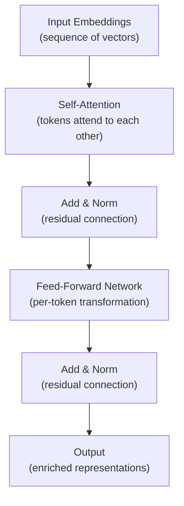

# Inside a Transformer Block: Attention, FFN, and Residuals

[](https://colab.research.google.com/github/vinod-seth/slm-development/blob/main/tutorial/02_transformer_architecture_for_practitioners/01_inside_a_transformer_block.ipynb)

| | |
|---|---|
| **Domain** | GenAI |
| **Module** | Transformer Architecture for Practitioners |
| **Difficulty** | Beginner |
| **Estimated Time** | 35 minutes |
| **Prerequisites** | Basic Python programming knowledge; familiarity with what a model is and training vs. <abbr title="Running a trained model to generate predictions or text output from new, unseen inputs.">inference</abbr>; no prior deep learning or NLP experience required |

---

## Lesson Roadmap

- **🟢 Core Concepts** — Understand the three components inside every transformer block: self-attention, feed-forward network, and residual connections. Non-engineers and ML beginners start here.
- **🔷 Technical Deep-Dive** — Inspect a real transformer block in PyTorch and Hugging Face Transformers. Engineers can run these code cells immediately.
- **Hands-On Exercise** — Print attention weight shapes and hidden-state sizes from a small GPT-2 run to ground the theory in real numbers.
- **Concept Check** — Three questions testing conceptual and applied understanding.
- **Summary & References** — Key takeaways and required academic citations.

---

## Learning Objectives

By the end of this lesson, you will be able to:

- Sketch the data flow through one transformer block: self-attention → feed-forward network → residual connection.
- Interpret the scaled dot-product attention formula at a conceptual level, citing Vaswani et al. (2017).
- Explain how layer count and hidden dimension jointly determine a model's parameter count.
- Differentiate encoder-only, decoder-only, and encoder-decoder architectures by use case.

---

## 🟢 Core Concepts

### The Transformer Block as an Assembly Line

A transformer model stacks identical blocks, one after another. Each block receives a sequence of vectors, enriches them with context, and passes the result to the next block. Think of each block as a quality-control station on a production line — it reads the item, annotates it with surrounding context, refines it, then sends it forward.

Every block contains exactly three stages:

1. **<abbr title="The core mechanism of Transformers allowing tokens to dynamically relate to and focus on other tokens in the sequence.">Self-attention</abbr>** — each token looks at every other token to gather context.
2. **Feed-forward network (FFN)** — each token's representation is independently transformed.
3. **Residual connection + layer normalization** — the block's input is added back to its output, stabilizing training.



### Self-Attention: Tokens Consulting Each Other

Self-attention answers the question: *Which other tokens in this sequence should I pay attention to?*

Each input token produces three vectors — a **Query (Q)**, a **Key (K)**, and a **Value (V)** — through separate learned linear projections. You can think of Q as "what am I looking for?", K as "what do I advertise about myself?", and V as "what do I actually contribute if selected?"

The attention score between two tokens is the dot product of one token's Query against another's Key, scaled by the square root of the key dimension. This scaling prevents dot products from growing too large as dimensionality increases — a practical stability trick from Vaswani et al. (2017) *<abbr title="A mechanism that lets neural networks focus on specific parts of the input sequence when generating output.">Attention</abbr> Is All You Need*. [https://arxiv.org/abs/1706.03762]

$$\text{Attention}(Q, K, V) = \text{softmax}\!\left(\frac{QK^T}{\sqrt{d_k}}\right)V$$

**Multi-head attention** runs this process in parallel across several independent subspaces — called heads. Each head can specialize: one head might track syntactic agreement, another might track coreference. Their outputs are concatenated and projected back to the model's hidden dimension.

### Feed-Forward Network and Residual Connections

After attention, each token's vector passes through a small two-layer network applied position-wise (independently per token). This FFN typically expands the hidden dimension by a factor of 4, applies a non-linearity (GELU or ReLU), then projects back down.

Residual connections add the block's *input* to its *output* at each stage. This gives gradients a direct path to earlier layers during training — a technique that makes deep networks practical. Layer normalization is applied either before (pre-norm, common in modern <abbr title="Small Language Model: a compact language model (under ~3B parameters) that can run on consumer hardware.">SLMs</abbr>) or after (post-norm, original paper) each sublayer.

### How Parameters Scale

Two numbers define a model's size:

| Factor | What it controls |
|---|---|
| **Hidden dimension** (`d_model`) | Width of every vector throughout the model |
| **Number of layers** | Depth — how many blocks are stacked |

A rough parameter estimate for the attention + FFN per block is `~12 × d_model²`. Multiply by the number of layers and you get the bulk of the model. This is why doubling `d_model` quadruples per-block parameters.

### Architecture Variants

| Architecture | Attention masking | Typical use case |
|---|---|---|
| **Encoder-only** (e.g., BERT, ModernBERT) | Bidirectional — every token sees every other | Classification, named-entity recognition, embeddings |
| **Decoder-only** (e.g., GPT-2, SmolLM2, Llama) | Causal — each token sees only past tokens | Text generation, language modeling |
| **Encoder-decoder** (e.g., T5, FLAN-T5) | Encoder bidirectional + cross-attention in decoder | Translation, summarization, question answering |

> [!IMPORTANT]
> Small Language Models (SLMs) such as SmolLM2-135M and SmolLM2-360M use decoder-only architecture. You will train and fine-tune decoder-only models throughout this course.

---

## 🔷 Technical Deep-Dive

### Environment Setup

Install the required packages before running the cells below.

```bash
# Python 3.11 recommended — matches the course devcontainer
pip install torch==2.3.1 transformers==4.43.3 datasets==2.20.1 --quiet
```

> [!NOTE]
> If you are setting up your environment for the first time, complete Module 1 / Lesson 3 (Environment Setup) before continuing here. All version pins were last verified: 2025-06.

### Inspecting a Transformer Block's Configuration

Load GPT-2 small — a public, non-gated decoder-only model with 12 layers and `d_model = 768`. Its architecture mirrors the SLMs you will train later in the course.

```python
"""
Explore GPT-2's transformer block dimensions.
Demonstrates how layer count and hidden size determine parameter count.
"""

from transformers import GPT2Config, GPT2Model
import torch

# Load configuration without downloading weights — fast, no network required
config = GPT2Config.from_pretrained("gpt2")

print("=== GPT-2 Small Architecture ===")
print(f"Layers (num_hidden_layers): {config.num_hidden_layers}")
print(f"Hidden dimension (n_embd):  {config.n_embd}")
print(f"Attention heads:            {config.num_attention_heads}")
print(f"FFN intermediate size:      {config.n_inner or config.n_embd * 4}")
print(f"Vocabulary size:            {config.vocab_size}")

# Rough parameter estimate per transformer block (attention + FFN)
d_model = config.n_embd
params_per_block = 12 * (d_model ** 2)
total_block_params = params_per_block * config.num_hidden_layers

print(f"\n=== Estimated Parameters ===")
print(f"Per block (approx):  {params_per_block:,}")
print(f"All blocks (approx): {total_block_params:,}")
```

**Expected output:**
```
=== GPT-2 Small Architecture ===
Layers (num_hidden_layers): 12
Hidden dimension (n_embd):  768
Attention heads:            12
FFN intermediate size:      3072
Vocabulary size:            50257

=== Estimated Parameters ===
Per block (approx):  7,077,888
All blocks (approx): 84,934,656
```

GPT-2 small has ~117 M total parameters. The difference from our estimate accounts for the embedding table and output projection.

### Extracting Attention Weights at Runtime

Now load the full model and inspect real attention weights for a short input sequence.

```python
"""
Forward-pass through GPT-2 and inspect per-head attention weights.
Confirms the (batch, heads, seq_len, seq_len) shape of attention outputs.
"""

from transformers import GPT2Tokenizer, GPT2Model
import torch

tokenizer = GPT2Tokenizer.from_pretrained("gpt2")
model = GPT2Model.from_pretrained("gpt2", output_attentions=True)
model.eval()

sample_text = "The orbital period of a satellite depends on altitude."

with torch.no_grad():
    encoded = tokenizer(sample_text, return_tensors="pt")
    outputs = model(**encoded)

attention_layers = outputs.attentions  # tuple: one tensor per layer

print(f"Number of attention layers:  {len(attention_layers)}")
print(f"Shape per layer (B, H, S, S): {attention_layers[0].shape}")
# Expected: (1, 12, 10, 10) for batch=1, heads=12, seq_len=10, seq_len=10

# Inspect which tokens the first head in the last layer attends to most
last_layer_head_0 = attention_layers[-1][0, 0, :, :]  # (seq_len, seq_len)
token_labels = tokenizer.convert_ids_to_tokens(encoded["input_ids"][0])

print(f"\nTokens: {token_labels}")
print(f"\nAttention matrix (last layer, head 0):\n{last_layer_head_0.numpy().round(3)}")
```

> [!NOTE]
> The `output_attentions=True` flag tells Hugging Face to return all attention weight tensors. By default they are discarded to save memory.

### Comparing Architecture Configs Programmatically

The following snippet loads a SmolLM2 config and contrasts it against GPT-2 — no weights downloaded, just metadata.

```python
"""
Compare decoder-only SLM configs: SmolLM2-135M vs GPT-2 small.
SmolLM2 is HuggingFaceTB's sub-1B model family (2024).
Model card: https://huggingface.co/HuggingFaceTB/SmolLM2-135M
Last verified: 2025-06
"""

from transformers import AutoConfig

configs = {
    "SmolLM2-135M": "HuggingFaceTB/SmolLM2-135M",
    "GPT-2 Small":  "gpt2",
}

header = f"{'Model':<20} {'Layers':>8} {'d_model':>8} {'Heads':>8} {'FFN 4x':>10}"
print(header)
print("-" * len(header))

for label, model_id in configs.items():
    cfg = AutoConfig.from_pretrained(model_id)

    # Normalize attribute names — SmolLM2 uses LlamaConfig field names
    layers   = getattr(cfg, "num_hidden_layers", "N/A")
    d_model  = getattr(cfg, "hidden_size",       getattr(cfg, "n_embd", "N/A"))
    heads    = getattr(cfg, "num_attention_heads", "N/A")
    ffn_size = getattr(cfg, "intermediate_size",  getattr(cfg, "n_inner", None))
    if ffn_size is None and d_model != "N/A":
        ffn_size = d_model * 4

    print(f"{label:<20} {layers:>8} {d_model:>8} {heads:>8} {ffn_size:>10}")
```

**Expected output (values approximate — verify against current HF Hub):**
```
Model                Layers  d_model    Heads     FFN 4x
----------------------------------------------------
SmolLM2-135M             30      576       9       1536
GPT-2 Small              12      768      12       3072
```

SmolLM2-135M is narrower (`d_model=576`) but surprisingly deep (30 layers). This design prioritizes reasoning depth over representational width — a trade-off you will revisit in Module 3.

---

## Hands-On Exercise

**Goal:** Verify your understanding of attention shape by running GPT-2 on your own sentence.

**Steps:**

1. Copy the attention weight extraction script above into a Jupyter cell.
2. Replace `sample_text` with a sentence of your own — minimum 8 tokens.
3. Confirm the attention tensor shape matches `(1, 12, seq_len, seq_len)`.
4. Identify which token index receives the highest cumulative attention in the *first* layer, head 0, by summing attention scores across the query dimension:

```python
"""
Find the most-attended token in layer 0, head 0.
"""

first_layer_head_0 = attention_layers[0][0, 0, :, :]  # (seq_len, seq_len)
summed_attention = first_layer_head_0.sum(dim=0)       # sum across query positions
most_attended_idx = summed_attention.argmax().item()

print(f"Most-attended token: '{token_labels[most_attended_idx]}' "
      f"(index {most_attended_idx})")
print(f"Attention score sum: {summed_attention[most_attended_idx]:.3f}")
```

**Verifiable outcome:** You see a named token printed alongside a non-zero attention sum. The result will differ per sentence — there is no single correct answer. The exercise confirms the code ran end-to-end on your text.

> [!NOTE]
> High attention on punctuation tokens or the first token is common and expected in early GPT-2 layers. This is a known artifact, not an error.

---

## Concept Check

**Question 1**

What does the scaling factor `√d_k` in the attention formula prevent?

* [ ] A) It prevents the model from attending to padding tokens.
* [x] B) It prevents dot products from growing so large that softmax gradients vanish.
* [ ] C) It prevents the FFN from expanding the hidden dimension too aggressively.
* [ ] D) It limits the number of attention heads that can be used simultaneously.

<details>
<summary>🔑 Click to Reveal Answer & Explanation</summary>

**Correct Answer:** B

**Explanation:**
As `d_k` grows, raw dot products grow in magnitude, pushing softmax into a region where gradients are near zero. Dividing by `√d_k` keeps scores in a numerically stable range. Vaswani et al. (2017) document this explicitly in Section 3.2.1 of the paper.

</details>

---

**Question 2**

A decoder-only model has 30 layers and `d_model = 576`. Using the approximation `12 × d_model²` per block, what is the estimated total parameter count across all blocks?

* [ ] A) ~34 million
* [ ] B) ~60 million
* [x] C) ~120 million
* [ ] D) ~200 million

<details>
<summary>🔑 Click to Reveal Answer & Explanation</summary>

**Correct Answer:** C

**Calculation:**
`12 × (576²) × 30 = 12 × 331,776 × 30 = 119,439,360 ≈ 120 million`

This matches SmolLM2-135M's approximate block parameter count. The remaining ~15 M come from the embedding table and output head.

</details>

---

**Question 3 — Reflection**

You are building a domain-specific spell-checker for scientific papers. It needs to classify each word as correctly or incorrectly spelled using rich bidirectional context.

Which architecture family fits best, and why? Write 2–3 sentences in your own words before expanding the hint.

<details>
<summary>🔑 Click to Reveal Answer & Explanation</summary>

**Recommended architecture:** Encoder-only (e.g., BERT-family, ModernBERT)

**Reasoning:**
A spell-checker is a classification task — it assigns a label per token. Encoder-only models use bidirectional attention, meaning every token can attend to both left and right neighbors. This is exactly what you need to assess whether "teh" is a typo given surrounding words. Decoder-only models use causal masking, which hides future tokens, making them less natural for classification over complete sequences.

</details>

---

## Summary

- A transformer block processes tokens through three sequential stages: self-attention (cross-token context), a feed-forward network (per-token transformation), and residual + layer norm connections that stabilize gradient flow.
- Scaled dot-product attention — `softmax(QKᵀ / √dₖ) V` — lets every token weigh every other token's contribution. The `√dₖ` scaling prevents softmax saturation (Vaswani et al., 2017).
- Total parameter count scales roughly as `12 × d_model² × num_layers` for the transformer blocks alone. Doubling `d_model` quadruples per-block parameters, making hidden dimension the dominant cost driver.
- Encoder-only models use bidirectional attention and suit classification tasks. Decoder-only models use causal attention and suit generation. Encoder-decoder models combine both and suit tasks with distinct input and output sequences (e.g., translation).
- SmolLM2 (decoder-only, 135 M–1.7 B parameters) is the primary model family used in this course. Its architecture config is publicly available at HuggingFace without gating.

---

## References & Credits

- Vaswani et al. (2017) *Attention Is All You Need.* [https://arxiv.org/abs/1706.03762]
  — Original transformer paper. Source of the scaled dot-product attention formula and multi-head attention design.

- Hu et al. (2021) *<abbr title="Low-Rank Adaptation: an efficient fine-tuning method that freezes base model weights and injects small trainable adapter matrices.">LoRA</abbr>: Low-Rank Adaptation of Large Language Models.* [https://arxiv.org/abs/2106.09685]
  — Introduced the LoRA <abbr title="Adapting a pre-trained model to a specific task by training it further on a smaller, targeted dataset.">fine-tuning</abbr> method covered in Module 4 of this course. Mentioned here because <abbr title="Parameter-Efficient Fine-Tuning: techniques (like LoRA) that adapt pre-trained models by updating only a tiny fraction of parameters.">PEFT</abbr> appears in the course tech stack from Module 1 onward.

- HuggingFace TB, *SmolLM2 Model Family.* [https://huggingface.co/HuggingFaceTB/SmolLM2-135M] — Last verified: 2025-06.
  — Primary SLM family used throughout this course. Apache 2.0 license.

- Wolf et al. (2020) *Transformers: State-of-the-Art Natural Language Processing.* [https://arxiv.org/abs/1910.03771]
  — Reference for the Hugging Face Transformers library (version 4.43.3 used in this lesson).

> [!NOTE]
> All libraries referenced in this lesson are released under permissive open-source licenses: PyTorch (BSD-style), Hugging Face Transformers (Apache 2.0), Datasets (Apache 2.0).
---

## 📝 Chapter Quiz

**Question 1:** What is a defining characteristic of Small Language Models (SLMs) in relation to 01 Inside A Transformer Block Attention Ffn And Residuals?

* [ ] They require supercomputers to run single queries
* [x] They deliver high parameter efficiency and lower latency, making them ideal for edge and domain-specific deployment
* [ ] They cannot perform text classification
* [ ] They do not use transformer architectures

<details>
<summary>🔑 Click to Reveal Answer & Explanation</summary>

**Correct Answer:** They deliver high parameter efficiency and lower latency, making them ideal for edge and domain-specific deployment

**Explanation:** SLMs focus on resource efficiency and high task-specific performance with lower computational overhead.
</details>

**Question 2:** What is the primary advantage of Automatic Mixed Precision (AMP) during training?

* [ ] It increases RAM consumption
* [x] It uses FP16/BF16 to speed up matrix math and cut GPU memory usage without losing precision stability
* [ ] It disables backpropagation
* [ ] It converts models to JSON

<details>
<summary>🔑 Click to Reveal Answer & Explanation</summary>

**Correct Answer:** It uses FP16/BF16 to speed up matrix math and cut GPU memory usage without losing precision stability

**Explanation:** AMP accelerates training on modern GPU Tensor Cores while maintaining numerical precision.
</details>

**Question 3:** In Parameter-Efficient Fine-Tuning (PEFT), what does LoRA stand for?

* [ ] Long-Range Attention
* [x] Low-Rank Adaptation
* [ ] Local Tensor Optimization
* [ ] Linear Order Representation

<details>
<summary>🔑 Click to Reveal Answer & Explanation</summary>

**Correct Answer:** Low-Rank Adaptation

**Explanation:** Low-Rank Adaptation freezes base model weights and injects trainable rank decomposition matrices.
</details>

**Question 4:** Why is gradient clipping used during neural network training loops?

* [ ] To erase model weights
* [x] To prevent exploding gradients by capping the maximum gradient norm
* [ ] To speed up data downloading
* [ ] To double the batch size

<details>
<summary>🔑 Click to Reveal Answer & Explanation</summary>

**Correct Answer:** To prevent exploding gradients by capping the maximum gradient norm

**Explanation:** Gradient clipping caps extreme gradient values, preventing numerical instability and NaN losses.
</details>

**Question 5:** What does Perplexity measure in causal language modeling?

* [ ] GPU temperature
* [x] The exponentiated cross-entropy loss, quantifying how well a model predicts the next token
* [ ] The file size on disk
* [ ] The number of dataset rows

<details>
<summary>🔑 Click to Reveal Answer & Explanation</summary>

**Correct Answer:** The exponentiated cross-entropy loss, quantifying how well a model predicts the next token

**Explanation:** Lower perplexity indicates that the model is more confident and accurate in its token predictions.
</details>

**Question 6:** Which quantization format is commonly used for serving GGUF models on CPUs via llama.cpp?

* [ ] FP64
* [x] 4-bit or 8-bit integer quantization (e.g. Q4_K_M, Q8_0)
* [ ] 32-bit float
* [ ] String encoding

<details>
<summary>🔑 Click to Reveal Answer & Explanation</summary>

**Correct Answer:** 4-bit or 8-bit integer quantization (e.g. Q4_K_M, Q8_0)

**Explanation:** Integer quantization reduces memory footprints by 4x, enabling fast CPU and edge inference.
</details>

**Question 7:** What is the role of an attention mask in transformer input processing?

* [ ] To hide model parameters
* [x] To indicate which tokens are real context versus padding tokens that should be ignored
* [ ] To encrypt output text
* [ ] To increase learning rate

<details>
<summary>🔑 Click to Reveal Answer & Explanation</summary>

**Correct Answer:** To indicate which tokens are real context versus padding tokens that should be ignored

**Explanation:** Attention masks prevent the model from attending to zero-padded tokens during batch processing.
</details>

**Question 8:** What is the purpose of a Model Card in Responsible AI development?

* [ ] To store API keys
* [x] To document model architecture, intended use cases, evaluation benchmarks, and safety limitations
* [ ] To compile Python code
* [ ] To license GPUs

<details>
<summary>🔑 Click to Reveal Answer & Explanation</summary>

**Correct Answer:** To document model architecture, intended use cases, evaluation benchmarks, and safety limitations

**Explanation:** Model Cards provide transparent documentation regarding model performance, training data, and safety boundaries.
</details>
