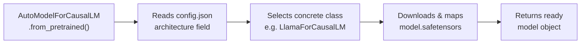

# Loading and Inspecting Pretrained SLMs with Hugging Face

| | |
|---|---|
| **Domain** | GenAI |
| **Module** | Transformer Architecture for Practitioners |
| **Difficulty** | Beginner |
| **Estimated Time** | 30 minutes |
| **Prerequisites** | Basic Python programming knowledge; familiarity with what a model is and the difference between training and inference; no prior deep learning or NLP experience required |

---

## Lesson Roadmap

- **Core Concepts** — understand what a pretrained checkpoint is and how the Hugging Face Hub stores it
- **Technical Deep-Dive** — load SmolLM2-135M, inspect its config and parameter count, and run your first inference call in under 10 minutes of reading
- **Model Card Anatomy** — navigate the model card to find training data, license, and known limitations
- **Hands-On Exercise** — run a structured inspection script and record findings in a companion notebook
- **Concept Check & Summary** — confirm understanding before moving to Module 3's full training run

## Learning Objectives

By the end of this lesson, you will be able to:

- Load a pretrained `SmolLM2-135M` checkpoint using `AutoModelForCausalLM` and `AutoTokenizer`
- Inspect model architecture, total parameter count, and layer names programmatically
- Run a basic inference call and decode the output tokens to readable text
- Read a Hugging Face model card and locate training data, license, and known limitations

---

## 🟢 Core Concepts

### What a Pretrained Checkpoint Actually Is

A pretrained checkpoint is a snapshot of a model's learned weights at a specific point in training. Every file in the `HuggingFaceTB/SmolLM2-135M` repository on the Hub represents one piece of that snapshot.

```
HuggingFaceTB/SmolLM2-135M (Hub repository)
├── config.json          ← architecture blueprint
├── tokenizer.json       ← vocabulary + merge rules
├── tokenizer_config.json
├── model.safetensors    ← the actual weight tensors
└── README.md            ← the model card
```

Think of `config.json` as the blueprint for a building and `model.safetensors` as the building itself. Without the blueprint, you cannot interpret the building's rooms. Without the building, the blueprint is just paper.

### The Auto-Class Pattern

Hugging Face uses *Auto classes* to remove the need to know a model's exact Python class name. `AutoModelForCausalLM.from_pretrained("HuggingFaceTB/SmolLM2-135M")` reads `config.json`, determines the correct architecture class (`LlamaForCausalLM` in SmolLM2's case), and instantiates it — all in one call.



### Tokenization in One Paragraph

Before any text reaches the model, it passes through a tokenizer. The tokenizer converts raw characters into integer IDs using a vocabulary built during the model's original training. SmolLM2 uses Byte-Pair Encoding (BPE), a subword algorithm introduced by Sennrich et al. (2016) that balances vocabulary size against the ability to represent rare words. The model never sees your original string — only those integer IDs.

> [!IMPORTANT]
> Always use the tokenizer that ships with the checkpoint. A mismatched tokenizer produces garbage token IDs and silently corrupts every output.

### Why 135M Parameters Matters at This Stage

SmolLM2-135M has approximately 135 million trainable parameters. On a modern laptop CPU, the full model fits comfortably in under 600 MB of RAM. This makes it the right tool for learning inspection and inference mechanics before scaling to larger checkpoints that require a GPU.

> [!NOTE]
> The Phi-2 (2.7B) VRAM footprint discussion is covered in the optional sidebar in the Module 2 README. You do not need it here.

---

## 🔷 Technical Deep-Dive

### Environment Check

Confirm your environment matches Module 1's setup before running any cell.

```bash
# In your activated virtual environment
python --version          # Expected: Python 3.11.x
pip show transformers     # Expected: transformers 4.40+
pip show torch            # Expected: torch 2.2+
```

> [!NOTE]
> If you skipped environment setup, complete Lesson 1 (Environment Setup) before continuing. Mismatched package versions cause silent errors in `from_pretrained`.

---

### Step 1 — Load the Tokenizer and Model

```python
# lesson3_inspect.py
# Loads SmolLM2-135M, inspects it, and runs one inference call.
# Last verified: 2025-06  (HuggingFaceTB/SmolLM2-135M on HF Hub)

import torch
from transformers import AutoModelForCausalLM, AutoTokenizer

CHECKPOINT = "HuggingFaceTB/SmolLM2-135M"
DEVICE = "cuda" if torch.cuda.is_available() else "cpu"

print(f"Loading checkpoint: {CHECKPOINT}")
print(f"Using device: {DEVICE}")

tokenizer = AutoTokenizer.from_pretrained(CHECKPOINT)
model = AutoModelForCausalLM.from_pretrained(
    CHECKPOINT,
    torch_dtype=torch.float32,   # float32 for CPU compatibility
)
model = model.to(DEVICE)
model.eval()  # disable dropout; we are running inference, not training

print("Model and tokenizer loaded successfully.")
```

**Expected output:**

```
Loading checkpoint: HuggingFaceTB/SmolLM2-135M
Using device: cpu
Model and tokenizer loaded successfully.
```

The first run downloads weights (~270 MB). Subsequent runs load from the local cache at `~/.cache/huggingface/hub`.

---

### Step 2 — Inspect the Architecture Config

```python
# Inspect architecture hyperparameters from config.json
cfg = model.config

print(f"Architecture class : {cfg.model_type}")
print(f"Hidden dimension   : {cfg.hidden_size}")
print(f"Attention heads    : {cfg.num_attention_heads}")
print(f"KV heads (GQA)     : {cfg.num_key_value_heads}")
print(f"Transformer layers : {cfg.num_hidden_layers}")
print(f"Vocabulary size    : {cfg.vocab_size:,}")
print(f"Max sequence length: {cfg.max_position_embeddings:,}")
```

**Expected output (SmolLM2-135M, 2025-06):**

```
Architecture class : llama
Hidden dimension   : 576
Attention heads    : 9
KV heads (GQA)     : 3
Transformer layers : 30
Vocabulary size    : 49,152
Max sequence length: 2,048
```

> [!NOTE]
> SmolLM2 uses Grouped Query Attention (GQA), where 9 query heads share 3 key-value heads. GQA reduces KV-cache memory during inference without degrading quality significantly. Vaswani et al. (2017) introduced the original multi-head attention formula this builds upon.

---

### Step 3 — Count Total Parameters

```python
def count_parameters(model: torch.nn.Module) -> dict:
    """Returns total, trainable, and frozen parameter counts."""
    total = sum(p.numel() for p in model.parameters())
    trainable = sum(p.numel() for p in model.parameters() if p.requires_grad)
    return {
        "total": total,
        "trainable": trainable,
        "frozen": total - trainable,
    }

param_stats = count_parameters(model)

print(f"Total parameters    : {param_stats['total']:,}")
print(f"Trainable parameters: {param_stats['trainable']:,}")
print(f"Frozen parameters   : {param_stats['frozen']:,}")
```

**Expected output:**

```
Total parameters    : 134,515,200
Trainable parameters: 134,515,200
Frozen parameters   : 0
```

All parameters are trainable by default. When you apply LoRA fine-tuning in Module 4, only a small subset will remain trainable — Hu et al. (2021) showed that training as few as 0.1% of parameters can match full fine-tuning on many tasks.

---

### Step 4 — Print Named Layers

```python
# Print first 15 named modules to understand the layer hierarchy
named_layers = list(model.named_modules())

print(f"Total named modules: {len(named_layers)}\n")
print("First 15 layers:")
print("-" * 60)
for name, module in named_layers[:15]:
    module_type = type(module).__name__
    print(f"  {name:<40} {module_type}")
```

**Expected output (truncated):**

```
Total named modules: 334

First 15 layers:
------------------------------------------------------------
                                         LlamaForCausalLM
  model                                  LlamaModel
  model.embed_tokens                     Embedding
  model.layers                           ModuleList
  model.layers.0                         LlamaDecoderLayer
  model.layers.0.self_attn               LlamaAttention
  model.layers.0.self_attn.q_proj        Linear
  model.layers.0.self_attn.k_proj        Linear
  model.layers.0.self_attn.v_proj        Linear
  model.layers.0.self_attn.o_proj        Linear
  model.layers.0.mlp                     LlamaMLP
  model.layers.0.mlp.gate_proj           Linear
  model.layers.0.mlp.up_proj             Linear
  model.layers.0.mlp.down_proj           Linear
  model.layers.0.input_layernorm         LlamaRMSNorm
```

Each `LlamaDecoderLayer` contains one self-attention block and one MLP block — the pattern repeats 30 times in this model.

---

### Step 5 — Run Your First Inference Call

```python
PROMPT = "The three main causes of ocean acidification are"

# Tokenize the prompt
input_ids = tokenizer(
    PROMPT,
    return_tensors="pt",
).input_ids.to(DEVICE)

print(f"Prompt token count: {input_ids.shape[1]}")

# Generate up to 60 new tokens using greedy decoding
with torch.no_grad():
    output_ids = model.generate(
        input_ids,
        max_new_tokens=60,
        do_sample=False,          # greedy decoding — deterministic
        repetition_penalty=1.1,   # mild penalty to reduce looping
        pad_token_id=tokenizer.eos_token_id,
    )

# Decode only the newly generated tokens (exclude the prompt)
generated_ids = output_ids[0, input_ids.shape[1]:]
generated_text = tokenizer.decode(generated_ids, skip_special_tokens=True)

print(f"\nPrompt : {PROMPT}")
print(f"Output : {generated_text}")
```

**Example output** (greedy decoding; exact tokens may vary across transformers versions):

```
Prompt token count: 11

Prompt : The three main causes of ocean acidification are
Output :  the burning of fossil fuels, deforestation, and
          the release of carbon dioxide from the ocean floor.
          These three factors are responsible for...
```

> [!IMPORTANT]
> SmolLM2-135M is a base model, not an instruction-tuned model. It completes text; it does not follow chat instructions. Use `HuggingFaceTB/SmolLM2-135M-Instruct` for instruction-following behavior.

---

### Step 6 — Reading a Hugging Face Model Card

Open [`https://huggingface.co/HuggingFaceTB/SmolLM2-135M`](https://huggingface.co/HuggingFaceTB/SmolLM2-135M) and locate these four sections:

| Section | What to Look For | SmolLM2-135M Value |
|---|---|---|
| **Model Details** | Architecture, release date, parameter count | 135M, LLaMA-style decoder |
| **Training Data** | Dataset names and token counts | FineWeb-Edu, DCLM, The Stack |
| **License** | Permitted commercial use? | Apache 2.0 ✅ |
| **Limitations** | Known failure modes and bias notes | Limited multi-step reasoning; limited non-English coverage |

> [!IMPORTANT]
> For gated models (e.g., Llama 3 family), you must accept the license on the Hub webpage and set `HF_TOKEN` as an environment variable before calling `from_pretrained`. Store your token in a `.env` file — never hardcode it in source files. Use `python-dotenv` to load it at runtime.

```python
# Secure token loading pattern for gated models (not needed for SmolLM2-135M)
import os
from dotenv import load_dotenv

load_dotenv()  # reads .env from the current working directory
hf_token = os.environ.get("HF_TOKEN")

if hf_token is None:
    raise EnvironmentError(
        "HF_TOKEN not set. Add it to your .env file. "
        "See: https://huggingface.co/settings/tokens"
    )
```

---

## Hands-On Exercise

**Goal:** Produce a written inspection report for SmolLM2-135M by running the script above in a Jupyter notebook and recording your findings.

**Setup:**

```bash
jupyter lab lesson3_inspect.ipynb
```

**Steps:**

1. Run Steps 1–4 from the Technical Deep-Dive above in sequential notebook cells.
2. In a Markdown cell, answer these questions from your output:
   - What is the `hidden_size`?
   - How many total parameters does the model have?
   - Name two layer types that appear in every decoder block.
3. Change `PROMPT` in Step 5 to a topic of your choice. Run it. Paste the output into your notebook.
4. Open the SmolLM2-135M model card on the Hub. Record the license type and one stated limitation in a Markdown cell.

**Verifiable outcome:** Your notebook has five cells with outputs matching the expected values from Steps 1–4, plus your custom prompt output in Step 5.

> [!NOTE]
> If you encounter a `OSError: We couldn't connect to 'https://huggingface.co'` error, your environment lacks internet access. Run `huggingface-cli login` once to cache credentials, or pre-download the checkpoint with `snapshot_download("HuggingFaceTB/SmolLM2-135M")` on a connected machine.

---

## Concept Check

**Question 1**

Which file in a Hugging Face checkpoint repository defines the model's architecture hyperparameters (hidden size, number of layers, etc.)?

* [ ] `model.safetensors`
* [x] `config.json`
* [ ] `tokenizer.json`
* [ ] `README.md`

<details>
<summary>🔑 Click to Reveal Answer & Explanation</summary>

**Correct Answer:** `config.json`

**Explanation:**
`config.json` is the architecture blueprint. `AutoModelForCausalLM` reads it first to determine which Python class to instantiate and what hyperparameters to use. `model.safetensors` contains the weight tensors, not the structural definition.

</details>

---

**Question 2**

Examine this parameter-counting snippet:

```python
total = sum(p.numel() for p in model.parameters())
trainable = sum(p.numel() for p in model.parameters() if p.requires_grad)
```

After loading SmolLM2-135M with no modifications, what do you expect `total - trainable` to equal, and why?

* [x] 0, because all parameters have `requires_grad=True` by default in a freshly loaded model
* [ ] 134,515,200, because `from_pretrained` freezes all weights by default
* [ ] A small positive number, because embedding layers are always frozen
* [ ] It depends on the `torch_dtype` argument

<details>
<summary>🔑 Click to Reveal Answer & Explanation</summary>

**Correct Answer:** 0 — all parameters are trainable by default.

**Explanation:**
`from_pretrained` does not freeze weights. Every `nn.Parameter` starts with `requires_grad=True`. You explicitly freeze parameters by calling `param.requires_grad = False` (or using PEFT's `freeze_model` utilities). `torch_dtype` affects precision, not gradient tracking.

</details>

---

**Question 3**

A teammate runs inference and gets nonsensical output despite using the correct model. They used `AutoTokenizer.from_pretrained("bert-base-uncased")` with `AutoModelForCausalLM.from_pretrained("HuggingFaceTB/SmolLM2-135M")`. What is wrong?

* [ ] BERT's tokenizer produces too many tokens for SmolLM2 to process
* [ ] The model requires a GPU to decode correctly
* [x] The tokenizer vocabulary and merge rules do not match SmolLM2's training tokenizer, corrupting all token IDs
* [ ] `AutoTokenizer` cannot be used with causal language models

<details>
<summary>🔑 Click to Reveal Answer & Explanation</summary>

**Correct Answer:** Mismatched tokenizer — BERT uses a WordPiece vocabulary; SmolLM2 uses a BPE vocabulary with a different set of IDs.

**Explanation:**
Token ID 4321 in BERT's vocabulary maps to a completely different subword than ID 4321 in SmolLM2's vocabulary. The model receives valid-looking integers that encode entirely different meanings. Always load the tokenizer from the same checkpoint as the model.

</details>

---

**Open-Ended Reflection**

> Describe a real project domain — such as medical triage notes, embedded device logging, or a retail chatbot — where SmolLM2-135M's 135M-parameter scale would be *preferable* to a 7B model. Justify your reasoning using at least one of these factors: inference latency, memory budget, or data privacy.
>
> There is no single correct answer. A strong response names a specific deployment constraint (e.g., "must run on a Raspberry Pi 5 with 8 GB RAM at under 200 ms per token") and explains why the larger model would fail that constraint.

---

## Summary

- `AutoModelForCausalLM` and `AutoTokenizer` use the `config.json` blueprint to select the correct architecture class automatically — you never need to know the concrete class name upfront.
- `model.config`, `model.named_modules()`, and `sum(p.numel() for p in model.parameters())` give you a complete structural picture of any checkpoint without opening a single weight tensor manually.
- SmolLM2-135M is a base completion model, not an instruction model. Its Apache 2.0 license permits commercial use, but its model card notes limited multi-step reasoning and limited non-English coverage — always read the limitations section before deploying.

---

## References & Credits

- Vaswani et al. (2017) *Attention Is All You Need.* [https://arxiv.org/abs/1706.03762](https://arxiv.org/abs/1706.03762) — original multi-head attention formulation underlying SmolLM2's self-attention blocks.

- Sennrich et al. (2016) *Neural Machine Translation of Rare Words with Subword Units.* [https://arxiv.org/abs/1508.07909](https://arxiv.org/abs/1508.07909) — introduced Byte-Pair Encoding, the tokenization algorithm used by SmolLM2.

- Hu et al. (2021) *LoRA: Low-Rank Adaptation of Large Language Models.* [https://arxiv.org/abs/2106.09685](https://arxiv.org/abs/2106.09685) — foundational PEFT method referenced in the parameter-counting section; covered fully in Module 4.

- HuggingFaceTB. *SmolLM2-135M Model Card.* Hugging Face Hub. [https://huggingface.co/HuggingFaceTB/SmolLM2-135M](https://huggingface.co/HuggingFaceTB/SmolLM2-135M) — last verified: 2025-06.

- Hugging Face. *Transformers Documentation — Auto Classes.* [https://huggingface.co/docs/transformers/model_doc/auto](https://huggingface.co/docs/transformers/model_doc/auto) — Apache 2.0 license. Procedural similarity to standard `from_pretrained` usage in this lesson reflects shared API conventions, not reproduced prose.