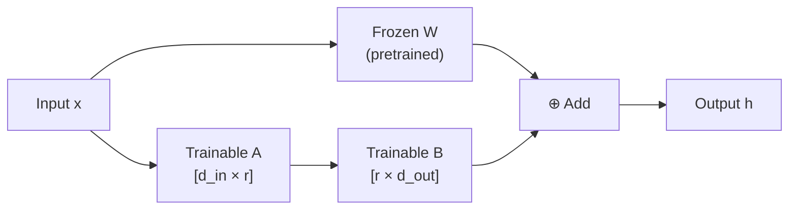

# LoRA Fine-Tuning: Theory and Implementation

| | |
|---|---|
| **Domain** | GenAI |
| **Module** | Fine-Tuning Pretrained SLMs with PEFT and LoRA |
| **Difficulty** | Beginner |
| **Estimated Time** | 40 minutes |
| **Prerequisites** | Basic Python programming knowledge, Familiarity with fundamental machine learning concepts (e.g., what a model is, training vs inference), No prior deep learning or NLP experience required |

> [!IMPORTANT]
> You must complete Module 3 ("Training Your First SLM from Scratch") and have at least one successful training run under your belt before working through this lesson. LoRA builds directly on the weight-update concepts introduced there.

---

## Lesson Roadmap

- **Core Concepts** — Understand what low-rank decomposition means and why it reduces trainable parameters dramatically
- **First API Contact** — Inspect trainable parameters before and after wrapping a model with `get_peft_model()` (within your first 10 minutes)
- **Technical Deep-Dive** — Configure `LoraConfig`, target attention layers, run a fine-tuning loop, and save adapter weights
- **Hands-On Exercise** — Fine-tune `microsoft/phi-2` on a short instruction dataset and verify the adapter checkpoint
- **Safety Warning** — Understand why LoRA adapters are not a substitute for content filtering or alignment techniques

---

## Learning Objectives

By the end of this lesson, you will be able to:

- Describe the LoRA low-rank decomposition technique and explain why it reduces trainable parameters, citing Hu et al. (2021)
- Configure a `LoraConfig` targeting attention projection layers with appropriate `rank`, `alpha`, and `dropout` values
- Apply `get_peft_model()` to wrap a pretrained SLM and inspect the resulting trainable parameter count
- Train a LoRA adapter on a text-generation task and save the adapter weights to disk

---

## 🟢 Core Concepts

### The Problem: Full Fine-Tuning Is Expensive

Full fine-tuning updates every weight in a model. For a 2.7-billion-parameter model like Phi-2, that means storing a full-precision copy of 2.7B gradients per training step. On a consumer GPU with 16 GB of VRAM, that is simply not feasible.

LoRA — **Low-Rank Adaptation** — solves this by updating only a small set of injected weight matrices instead of the original weights. Hu et al. (2021) showed that the weight changes learned during full fine-tuning have a low **intrinsic rank**: most of the useful update signal lives in a much smaller subspace than the full weight matrix.

### The Low-Rank Decomposition Idea

Every weight matrix **W** in a transformer (e.g., the query projection `W_q`) has shape `[d_in, d_out]`. LoRA freezes **W** and injects two small matrices, **A** and **B**, alongside it:

```
ΔW = B × A
```

Where:
- **A** has shape `[d_in, r]`
- **B** has shape `[r, d_out]`
- **r** is the rank — a small integer like 8 or 16

Instead of updating `d_in × d_out` parameters, you only update `r × (d_in + d_out)` parameters. At rank 8 with `d_in = d_out = 2048`, that is roughly **33,000** parameters instead of **4,194,304** — a 99.2% reduction.



### The Three Hyperparameters You Control

| Hyperparameter | What it does | Typical range |
|---|---|---|
| `r` (rank) | Controls adapter capacity. Higher rank = more expressive but more parameters. | 4–64 |
| `lora_alpha` | Scales the LoRA update: effective learning rate = `alpha / r`. | Usually set to `2 × r` |
| `lora_dropout` | Dropout applied to adapter activations — regularizes training. | 0.05–0.1 |

> [!NOTE]
> A common starting point is `r=8, alpha=16, dropout=0.05`. Increase rank only if your validation loss plateaus early.

### Where LoRA Gets Injected

LoRA targets specific weight matrices. The most effective targets in transformer attention blocks are the **query projection** (`q_proj`) and **value projection** (`v_proj`). Hu et al. (2021) found that adapting both provides the best quality-to-parameter trade-off.

> [!IMPORTANT]
> **Safety callout — LoRA is not an alignment mechanism.** A LoRA adapter changes the model's behavior on the distribution it was trained on. It does not add safety guarantees. System prompts and RLHF techniques are *soft* controls that reduce but do not eliminate harmful outputs. If your deployment requires content safety, add a dedicated output filter (e.g., a classification head or a moderation API call) as a separate layer. Do not rely on fine-tuning alone as a safety guarantee.

---

## 🔷 Technical Deep-Dive

### Environment Setup

```bash
# Tested with Python 3.11, CUDA 12.1, transformers 4.41, peft 0.11
pip install transformers==4.41.2 peft==0.11.1 datasets==2.19.2 \
            accelerate==0.30.1 torch==2.3.0 bitsandbytes==0.43.1
```

> [!NOTE]
> If you are setting up for the first time, complete the environment configuration in Lesson 3 first. These pinned versions were last verified: 2025-05. Re-verify against the HF Hub and PyPI before use if more than one quarter has elapsed.

### Step 1 — Load a Pretrained SLM

We use `microsoft/phi-2` (2.7B parameters, Apache 2.0 license) throughout this lesson. This is a publicly accessible, non-gated checkpoint.

```python
# lora_finetune.py
import os
import torch
from transformers import AutoTokenizer, AutoModelForCausalLM

MODEL_ID = "microsoft/phi-2"

# Load in float16 to reduce VRAM usage (~6 GB on a 16 GB GPU)
tokenizer = AutoTokenizer.from_pretrained(MODEL_ID, trust_remote_code=True)
tokenizer.pad_token = tokenizer.eos_token  # Phi-2 has no dedicated pad token

model = AutoModelForCausalLM.from_pretrained(
    MODEL_ID,
    torch_dtype=torch.float16,
    device_map="auto",         # Distributes across available GPUs/CPU
    trust_remote_code=True,
)
model.config.use_cache = False  # Required for gradient checkpointing compatibility
```

### Step 2 — Inspect Baseline Trainable Parameters

Before wrapping with PEFT, count the parameters. This is your baseline.

```python
def count_trainable_parameters(mdl: torch.nn.Module) -> tuple[int, int]:
    """Return (trainable_params, total_params)."""
    trainable = sum(p.numel() for p in mdl.parameters() if p.requires_grad)
    total = sum(p.numel() for p in mdl.parameters())
    return trainable, total


trainable_before, total_before = count_trainable_parameters(model)
print(f"Baseline  → trainable: {trainable_before:,} / total: {total_before:,}")
# Expected output: trainable: 2,779,683,840 / total: 2,779,683,840
```

Run this cell now — you should see that 100% of parameters are trainable before PEFT. This is the interactive checkpoint that confirms your model loaded correctly.

### Step 3 — Configure LoRA

```python
from peft import LoraConfig, get_peft_model, TaskType

# Hu et al. (2021) recommend targeting q_proj and v_proj for best efficiency
lora_cfg = LoraConfig(
    task_type=TaskType.CAUSAL_LM,
    r=8,                          # Rank: controls adapter expressiveness
    lora_alpha=16,                # Scaling factor — effective lr = alpha / r
    lora_dropout=0.05,            # Regularization on adapter activations
    target_modules=["q_proj", "v_proj"],  # Attention projection layers
    bias="none",                  # Do not adapt bias terms (saves parameters)
    inference_mode=False,         # Enable training mode
)
```

### Step 4 — Wrap the Model and Inspect Again

```python
peft_model = get_peft_model(model, lora_cfg)

trainable_after, total_after = count_trainable_parameters(peft_model)
pct = 100 * trainable_after / total_after

print(f"After PEFT → trainable: {trainable_after:,} / total: {total_after:,}")
print(f"Trainable parameter share: {pct:.4f}%")

# Hugging Face convenience wrapper — prints the same info with formatting
peft_model.print_trainable_parameters()
```

Expected output (approximate):

```
After PEFT → trainable: 2,883,584 / total: 2,782,567,424
Trainable parameter share: 0.1036%
trainable params: 2,883,584 || all params: 2,782,567,424 || trainable%: 0.1036
```

You went from 2.78 billion trainable parameters down to roughly 2.9 million — a **~965× reduction**.

### Step 5 — Prepare a Dataset

We use a minimal instruction dataset to keep GPU time short. The `timdettmers/openassistant-guanaco` dataset (Apache 2.0) works well for a first run.

```python
from datasets import load_dataset

RAW_DATASET = "timdettmers/openassistant-guanaco"
MAX_SAMPLES = 500   # Limit to 500 rows for a quick demo run
MAX_SEQ_LEN = 256   # Phi-2 supports 2048; we cap here for training speed

dataset = load_dataset(RAW_DATASET, split="train").select(range(MAX_SAMPLES))


def tokenize(batch: dict) -> dict:
    """Tokenize and create causal LM labels in one pass."""
    encoded = tokenizer(
        batch["text"],
        truncation=True,
        max_length=MAX_SEQ_LEN,
        padding="max_length",
    )
    # For causal LM, labels are identical to input_ids;
    # pad positions are masked with -100 so loss ignores them
    encoded["labels"] = [
        [-100 if token_id == tokenizer.pad_token_id else token_id for token_id in ids]
        for ids in encoded["input_ids"]
    ]
    return encoded


tokenized_dataset = dataset.map(
    tokenize,
    batched=True,
    remove_columns=dataset.column_names,
)
tokenized_dataset.set_format("torch")
```

### Step 6 — Training Loop with Hugging Face Trainer

```python
from transformers import TrainingArguments, Trainer, DataCollatorForSeq2Seq

OUTPUT_DIR = "./phi2_lora_adapter"

training_args = TrainingArguments(
    output_dir=OUTPUT_DIR,
    num_train_epochs=1,
    per_device_train_batch_size=2,
    gradient_accumulation_steps=4,    # Effective batch size = 8
    learning_rate=2e-4,
    fp16=True,                        # Match model dtype
    logging_steps=25,
    save_strategy="epoch",
    report_to="none",                 # Disable W&B for local runs
    optim="paged_adamw_8bit",         # Memory-efficient optimizer via bitsandbytes
)

data_collator = DataCollatorForSeq2Seq(
    tokenizer=tokenizer,
    model=peft_model,
    pad_to_multiple_of=8,
    return_tensors="pt",
)

trainer = Trainer(
    model=peft_model,
    args=training_args,
    train_dataset=tokenized_dataset,
    data_collator=data_collator,
)

trainer.train()
```

### Step 7 — Save and Reload the Adapter

LoRA saves only the adapter weights — not the full model. The checkpoint is typically under 15 MB.

```python
# Save adapter weights only (not the frozen base model)
peft_model.save_pretrained(OUTPUT_DIR)
tokenizer.save_pretrained(OUTPUT_DIR)

print(f"Adapter saved to: {os.path.abspath(OUTPUT_DIR)}")
# Verify the files exist
import pathlib
saved_files = list(pathlib.Path(OUTPUT_DIR).glob("*"))
print("Saved files:", [f.name for f in saved_files])
```

To reload and run inference later:

```python
from peft import PeftModel

# Load the frozen base model
base_model = AutoModelForCausalLM.from_pretrained(
    MODEL_ID,
    torch_dtype=torch.float16,
    device_map="auto",
    trust_remote_code=True,
)

# Attach the saved adapter
inference_model = PeftModel.from_pretrained(base_model, OUTPUT_DIR)
inference_model.eval()

# Quick sanity-check generation
test_prompt = "### Human: What is photosynthesis?\n### Assistant:"
inputs = tokenizer(test_prompt, return_tensors="pt").to(inference_model.device)

with torch.no_grad():
    output_ids = inference_model.generate(
        **inputs,
        max_new_tokens=80,
        temperature=0.7,
        do_sample=True,
        pad_token_id=tokenizer.eos_token_id,
    )

generated_text = tokenizer.decode(output_ids[0], skip_special_tokens=True)
print(generated_text)
```

---

## Hands-On Exercise

**Goal:** Fine-tune `microsoft/phi-2` with a rank-16 LoRA adapter on 200 samples and confirm that the adapter checkpoint is smaller than 20 MB.

**Step 1 — Modify the rank.** Change `r=8` to `r=16` and `lora_alpha=16` to `lora_alpha=32` in your `LoraConfig`. Re-run `peft_model.print_trainable_parameters()` and record the new trainable count.

**Step 2 — Reduce the sample size.** Set `MAX_SAMPLES = 200` and re-run the tokenization cell.

**Step 3 — Train for one epoch.** Run `trainer.train()` and note the final training loss in your Jupyter output.

**Step 4 — Verify the checkpoint size.**

```python
import pathlib

adapter_dir = pathlib.Path("./phi2_lora_adapter")
total_size_mb = sum(
    f.stat().st_size for f in adapter_dir.glob("**/*") if f.is_file()
) / (1024 ** 2)

print(f"Adapter checkpoint size: {total_size_mb:.2f} MB")
assert total_size_mb < 20, f"Expected < 20 MB, got {total_size_mb:.2f} MB"
print("✅ Size check passed.")
```

**Expected outcome:** The adapter directory contains `adapter_model.safetensors` (or `.bin`) plus `adapter_config.json`. Total size should be approximately 14–18 MB for rank 16.

**Reflection prompt:** Consider a real project where you need sub-millisecond-latency inference on a local device with no internet access. Would you use a full 2.7B-parameter model or a LoRA-adapted version loaded on top of a quantized base? What trade-offs does LoRA introduce in that context — think about latency at merge time, VRAM at inference, and the separation of adapter from base model.

> [!NOTE]
> Role-specific callout for **ML Engineers**: After validating your adapter checkpoint, consider using `merge_and_unload()` to fold the adapter weights into the base model for deployment. This eliminates adapter overhead at inference time.
>
> Role-specific callout for **Product Managers / Non-Engineers**: The practical meaning of a 15 MB adapter is that your team can ship domain-specific model behavior as a small file update rather than redeploying gigabytes of base model weights — similar to a software patch rather than a full reinstall.

---

## Concept Check

**Question 1 — Core mechanics**

LoRA injects two matrices, A and B, into a frozen weight matrix W. Which mathematical relationship describes the update?

* [x] `ΔW = B × A`, where A has shape `[d_in, r]` and B has shape `[r, d_out]`
* [ ] `ΔW = A + B`, where both matrices have the same shape as W
* [ ] `ΔW = W × r`, where r is the scaling rank factor
* [ ] `ΔW = A × W × B`, where W is updated in place

<details>
<summary>🔑 Click to Reveal Answer & Explanation</summary>

**Correct Answer:** Option A.

**Explanation:**
LoRA decomposes the weight update into the product of two low-rank matrices. A projects the input from `d_in` dimensions down to a compressed rank `r`, and B projects back up to `d_out`. The product `B × A` has the same shape as the original weight matrix W, so it can be added to W's output during the forward pass. The frozen W is never modified — only A and B are trained. This is the formulation described in Hu et al. (2021).

</details>

---

**Question 2 — Hyperparameter reasoning**

A colleague sets `lora_alpha=8` with `r=8`. Later they double the rank to `r=16` but forget to change `lora_alpha`. What is the effect on the effective update scale?

* [ ] The effective update scale doubles, which is likely desirable
* [x] The effective update scale halves (from `alpha/r = 1.0` to `0.5`), likely reducing the adapter's influence
* [ ] There is no effect because `alpha` is independent of `r`
* [ ] The effective update scale stays constant because `get_peft_model()` normalizes it automatically

<details>
<summary>🔑 Click to Reveal Answer & Explanation</summary>

**Correct Answer:** Option B.

**Explanation:**
The LoRA scaling factor applied to the adapter output is `lora_alpha / r`. When `alpha=8, r=8`, the scale is 1.0. When rank doubles to 16 without adjusting alpha, the scale drops to 0.5. This means the adapter contributes less to the output, effectively reducing how much the model changes relative to the pretrained baseline. The standard practice is to set `lora_alpha = 2 × r` so the scaling stays consistent when you tune rank.

</details>

---

**Question 3 — Safety reasoning (open-ended reflection)**

Your team fine-tunes an SLM using LoRA to answer customer support questions. A stakeholder asks: "Does fine-tuning make the model safe to deploy without any content filtering?" How do you respond?

* [ ] Yes — fine-tuning on domain-specific safe data fully removes the risk of harmful outputs
* [ ] Yes — LoRA modifies only small adapter weights, so the base model's safety alignment is preserved completely
* [x] No — LoRA (and fine-tuning generally) is a soft control that shifts model behavior but does not guarantee safety; a dedicated output filter is required
* [ ] No — LoRA breaks existing safety alignment, so you must retrain safety behaviors from scratch

<details>
<summary>🔑 Click to Reveal Answer & Explanation</summary>

**Correct Answer:** Option C.

**Explanation:**
Fine-tuning — including LoRA — adjusts model behavior toward the training distribution but cannot provide safety guarantees. System prompts and RLHF are similarly soft controls. They reduce the probability of harmful outputs but cannot eliminate them across all possible inputs, especially adversarial ones. Production deployments require a separate safety layer: an input length validator, an output classification step, or a call to a moderation API. LoRA adapters should be treated as a behavioral steering tool, not a security boundary.

</details>

---

## Summary

- **LoRA injects trainable low-rank matrices** alongside frozen pretrained weights. Hu et al. (2021) showed that weight updates have low intrinsic rank, making this decomposition both principled and effective — reducing trainable parameters by over 99% for models like Phi-2.
- **Three hyperparameters govern adapter behavior:** `r` (rank) controls adapter capacity, `lora_alpha` scales the update magnitude relative to rank, and `lora_dropout` regularizes adapter activations during training. A safe starting configuration is `r=8, alpha=16, dropout=0.05`.
- **Adapter checkpoints are small and composable:** `save_pretrained()` writes only the adapter weights (typically 10–20 MB), not the full base model. You can reload them with `PeftModel.from_pretrained()` and, for deployment, merge them into the base model using `merge_and_unload()`.
- **LoRA is not a safety mechanism.** Treating fine-tuned adapters as a content safety layer is a design error. Always pair LoRA-adapted models with a dedicated output filtering step in production.

---

## References & Credits

- Hu et al. (2021) *LoRA: Low-Rank Adaptation of Large Language Models.* [https://arxiv.org/abs/2106.09685](https://arxiv.org/abs/2106.09685)
- Brown et al. (2020) *Language Models are Few-Shot Learners.* [https://arxiv.org/abs/2005.14165](https://arxiv.org/abs/2005.14165)
- **microsoft/phi-2** model card — Microsoft Research. [https://huggingface.co/microsoft/phi-2](https://huggingface.co/microsoft/phi-2) *(Last verified: 2025-05)*
- **timdettmers/openassistant-guanaco** dataset — HuggingFace Hub. License: Apache 2.0. [https://huggingface.co/datasets/timdettmers/openassistant-guanaco](https://huggingface.co/datasets/timdettmers/openassistant-guanaco) *(Last verified: 2025-05)*
- **PEFT library documentation** — Hugging Face. License: Apache 2.0. [https://huggingface.co/docs/peft](https://huggingface.co/docs/peft) *(Last verified: 2025-05)*
- Dettmers et al. (2023) *QLoRA: Efficient Finetuning of Quantized LLMs.* [https://arxiv.org/abs/2305.14314](https://arxiv.org/abs/2305.14314) — Recommended reading for extending this lesson to 4-bit quantized training.

> [!NOTE]
> The installation sequence in this lesson follows standard Hugging Face library conventions. Procedural similarity to official documentation reflects that the setup steps are the correct minimal path — not reproduction of any specific guide.