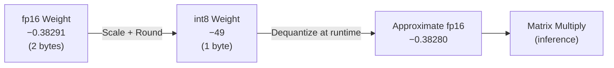
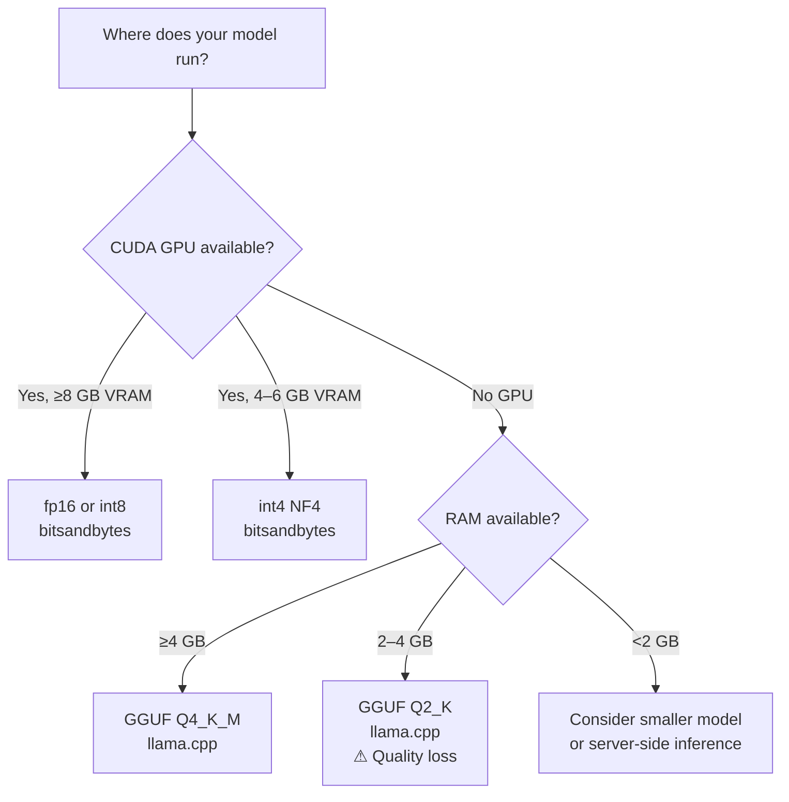

# Quantization: Shrinking Models for Edge and CPU Deployment

| | |
|---|---|
| **Domain** | GenAI |
| **Module** | Optimization and Deployment |
| **Difficulty** | Beginner |
| **Estimated Time** | 30 minutes |
| **Prerequisites** | Modules 1–4 completed; Python 3.11 environment with PyTorch installed; Hugging Face account (free tier sufficient); 8 GB RAM minimum |

> **Module Prerequisite Block**
> - ✅ Completed Module 4: Fine-Tuning with LoRA (at least one training run finished)
> - 🛠 Tools required: `bitsandbytes >= 0.43`, `transformers >= 4.40`, `torch >= 2.2`
> - ⏱ Estimated cumulative time from course start: ~14 hours

---

## 📍 Lesson Roadmap

- **Core Concepts** — Understand what quantization does to model weights, and why it matters for edge hardware
- **First Experiment** — Load a model in int8 mode and compare memory footprint (appears within the first 10 minutes)
- **Technical Deep-Dive** — Apply `load_in_8bit` and `load_in_4bit` with `bitsandbytes`; measure latency and output quality
- **GGUF & llama.cpp** — Explore CPU-native quantization formats for Raspberry Pi and laptop deployment
- **Hands-On Exercise** — Benchmark your fine-tuned SLM at fp16, int8, and int4 precision and document the trade-offs

---

## Learning Objectives

By the end of this lesson, you will be able to:

- Explain how int8 and int4 quantization reduce model size and memory usage without full retraining
- Apply `bitsandbytes` int8 and int4 quantization to a fine-tuned SLM using Hugging Face Transformers
- Benchmark inference latency and generation quality before and after quantization
- Select the appropriate quantization strategy for CPU, mobile, and server deployment targets

---

## 🟢 Core Concepts

### What Quantization Actually Does

A neural network stores millions of numbers — its weights. By default, those numbers use 32-bit or 16-bit floating-point format (fp32/fp16). Each fp16 weight occupies 2 bytes of memory.

Quantization replaces those high-precision numbers with lower-precision integers.

| Precision | Bits per weight | Bytes per weight | Typical use case |
|-----------|-----------------|------------------|------------------|
| fp32 | 32 | 4 | Training |
| fp16 / bf16 | 16 | 2 | GPU inference |
| int8 | 8 | 1 | Server CPU / edge GPU |
| int4 | 4 | 0.5 | Laptop CPU / Raspberry Pi |

A 360-million-parameter model at fp16 occupies roughly **720 MB** of RAM. The same model in int4 occupies about **180 MB** — a 4× reduction.

### The Compression Analogy

Think of a high-resolution photograph saved as a TIFF versus a JPEG at medium quality. The JPEG is far smaller. Most viewers cannot tell the difference in casual inspection. For specialized analysis, the quality loss becomes noticeable. Quantization works the same way: everyday inference tasks tolerate int8 well; highly nuanced generation may show slight degradation at int4.

### How Precision Reduction Works



A **scale factor** maps the continuous float range to the integer range. At inference time, the model dequantizes on the fly — only the stored weights are compressed, not the computation graph itself.

### int8 vs int4: Choosing Your Trade-Off

**int8** is the safer starting point:
- Minimal quality loss on most generation tasks
- Supported on CUDA GPUs and modern CPUs via `bitsandbytes`
- Well-tested with SmolLM2 and Phi-3 Mini model families

**int4** maximises compression:
- Enables models to run on devices with 4–8 GB RAM
- Requires careful calibration; perplexity increase is measurable
- GGUF format (used by `llama.cpp`) ships popular SLMs in Q4_K_M variants optimised for CPU

> [!IMPORTANT]
> `bitsandbytes` int8/int4 modes require a CUDA-capable GPU during the loading step unless you use `llama.cpp` or GGUF. Pure CPU quantization at load time is handled by `llama.cpp` — covered in the Technical Deep-Dive.

---

## 🔷 Technical Deep-Dive

### Environment Setup

```bash
# Verified against bitsandbytes 0.43.1 and transformers 4.41.0 (Last verified: 2025-05)
pip install bitsandbytes>=0.43 transformers>=4.40 accelerate>=0.29 torch>=2.2
```

> [!NOTE]
> On Windows (CMD, not PowerShell): run the same `pip install` command. CUDA-enabled `bitsandbytes` wheels are now available for Windows from PyPI since v0.41.

---

### Step 1: Baseline fp16 Load and Memory Measurement

This experiment runs within your first 10 minutes. Use `HuggingFaceTB/SmolLM2-360M-Instruct` — a publicly accessible, non-gated SLM well-suited to edge targets.

```python
# baseline_fp16.py
# Measures memory footprint and inference latency at fp16 precision.
# Compatible with: transformers>=4.40, torch>=2.2, Python 3.11
# No API keys required — model downloads from Hugging Face Hub.

import time
import torch
from transformers import AutoModelForCausalLM, AutoTokenizer

MODEL_ID = "HuggingFaceTB/SmolLM2-360M-Instruct"
PROMPT = "Summarize the water cycle in two sentences."

def load_model_fp16(model_id: str):
    """Load model at native fp16 precision."""
    tokenizer = AutoTokenizer.from_pretrained(model_id)
    model = AutoModelForCausalLM.from_pretrained(
        model_id,
        torch_dtype=torch.float16,
        device_map="auto",
    )
    return tokenizer, model


def measure_inference(tokenizer, model, prompt: str, max_new_tokens: int = 80):
    """Run a single forward pass and return latency + decoded output."""
    inputs = tokenizer(prompt, return_tensors="pt").to(model.device)

    start = time.perf_counter()
    with torch.no_grad():
        output_ids = model.generate(
            **inputs,
            max_new_tokens=max_new_tokens,
            do_sample=False,
        )
    elapsed_ms = (time.perf_counter() - start) * 1000

    decoded = tokenizer.decode(output_ids[0], skip_special_tokens=True)
    return elapsed_ms, decoded


def report_memory(model, label: str):
    """Print parameter count and approximate memory footprint."""
    param_bytes = sum(p.numel() * p.element_size() for p in model.parameters())
    print(f"[{label}] Parameters: {sum(p.numel() for p in model.parameters()):,}")
    print(f"[{label}] Approx. weight memory: {param_bytes / 1024**2:.1f} MB")


if __name__ == "__main__":
    tokenizer, model = load_model_fp16(MODEL_ID)
    report_memory(model, "fp16")

    latency, text = measure_inference(tokenizer, model, PROMPT)
    print(f"[fp16] Latency: {latency:.1f} ms")
    print(f"[fp16] Output: {text}\n")
```

**Expected output (approximate, single A10G GPU):**
```
[fp16] Parameters: 360,064,000
[fp16] Approx. weight memory: 687.6 MB
[fp16] Latency: 312.4 ms
[fp16] Output: Summarize the water cycle in two sentences.
Water evaporates from oceans and lakes, rises as water vapor ...
```

---

### Step 2: int8 Quantization with bitsandbytes

```python
# quantize_int8.py
# Loads the same model in int8 mode using bitsandbytes LLM.int8().
# Requires CUDA GPU. For CPU-only targets, skip to Step 4 (GGUF).

import time
import torch
from transformers import AutoModelForCausalLM, AutoTokenizer, BitsAndBytesConfig

MODEL_ID = "HuggingFaceTB/SmolLM2-360M-Instruct"
PROMPT = "Summarize the water cycle in two sentences."

def build_int8_config() -> BitsAndBytesConfig:
    """Return a BitsAndBytesConfig for 8-bit loading."""
    return BitsAndBytesConfig(load_in_8bit=True)


def load_model_int8(model_id: str, bnb_config: BitsAndBytesConfig):
    tokenizer = AutoTokenizer.from_pretrained(model_id)
    model = AutoModelForCausalLM.from_pretrained(
        model_id,
        quantization_config=bnb_config,
        device_map="auto",
    )
    return tokenizer, model


def report_memory(model, label: str):
    param_bytes = sum(p.numel() * p.element_size() for p in model.parameters())
    print(f"[{label}] Approx. weight memory: {param_bytes / 1024**2:.1f} MB")


def measure_inference(tokenizer, model, prompt: str, max_new_tokens: int = 80):
    inputs = tokenizer(prompt, return_tensors="pt").to(model.device)
    start = time.perf_counter()
    with torch.no_grad():
        output_ids = model.generate(
            **inputs,
            max_new_tokens=max_new_tokens,
            do_sample=False,
        )
    elapsed_ms = (time.perf_counter() - start) * 1000
    decoded = tokenizer.decode(output_ids[0], skip_special_tokens=True)
    return elapsed_ms, decoded


if __name__ == "__main__":
    bnb_config = build_int8_config()
    tokenizer, model = load_model_int8(MODEL_ID, bnb_config)
    report_memory(model, "int8")

    latency, text = measure_inference(tokenizer, model, PROMPT)
    print(f"[int8] Latency: {latency:.1f} ms")
    print(f"[int8] Output: {text}\n")
```

---

### Step 3: int4 Quantization (NF4 via bitsandbytes)

```python
# quantize_int4.py
# Applies 4-bit NormalFloat (NF4) quantization with double quantization enabled.
# NF4 is the format used by QLoRA; see Dettmers et al. (2023).

import time
import torch
from transformers import AutoModelForCausalLM, AutoTokenizer, BitsAndBytesConfig

MODEL_ID = "HuggingFaceTB/SmolLM2-360M-Instruct"
PROMPT = "Summarize the water cycle in two sentences."


def build_int4_config() -> BitsAndBytesConfig:
    """
    NF4 quantization with double quantization reduces memory further.
    bnb_4bit_compute_dtype controls the dtype used during the matmul,
    not the storage dtype.
    """
    return BitsAndBytesConfig(
        load_in_4bit=True,
        bnb_4bit_quant_type="nf4",
        bnb_4bit_use_double_quant=True,
        bnb_4bit_compute_dtype=torch.bfloat16,
    )


def load_model_int4(model_id: str, bnb_config: BitsAndBytesConfig):
    tokenizer = AutoTokenizer.from_pretrained(model_id)
    model = AutoModelForCausalLM.from_pretrained(
        model_id,
        quantization_config=bnb_config,
        device_map="auto",
    )
    return tokenizer, model


def report_memory(model, label: str):
    param_bytes = sum(p.numel() * p.element_size() for p in model.parameters())
    print(f"[{label}] Approx. weight memory: {param_bytes / 1024**2:.1f} MB")


def measure_inference(tokenizer, model, prompt: str, max_new_tokens: int = 80):
    inputs = tokenizer(prompt, return_tensors="pt").to(model.device)
    start = time.perf_counter()
    with torch.no_grad():
        output_ids = model.generate(
            **inputs,
            max_new_tokens=max_new_tokens,
            do_sample=False,
        )
    elapsed_ms = (time.perf_counter() - start) * 1000
    decoded = tokenizer.decode(output_ids[0], skip_special_tokens=True)
    return elapsed_ms, decoded


if __name__ == "__main__":
    bnb_config = build_int4_config()
    tokenizer, model = load_model_int4(MODEL_ID, bnb_config)
    report_memory(model, "int4")

    latency, text = measure_inference(tokenizer, model, PROMPT)
    print(f"[int4] Latency: {latency:.1f} ms")
    print(f"[int4] Output: {text}\n")
```

---

### Step 4: CPU Inference with GGUF and llama.cpp

For targets with no GPU — a Raspberry Pi 5, a MacBook with Apple Silicon, or a standard laptop — GGUF is the practical standard. SmolLM2 GGUF files are hosted on Hugging Face.

```bash
# Install llama-cpp-python (CPU build)
# Last verified: llama-cpp-python 0.2.77, May 2025
pip install llama-cpp-python>=0.2.77
```

```python
# cpu_inference_gguf.py
# Runs SmolLM2-360M in Q4_K_M GGUF format on CPU.
# No GPU required. Tested on 8 GB RAM laptop.

import time
from llama_cpp import Llama

# Q4_K_M: 4-bit quantization with medium-quality key/value matrices.
# Download from: https://huggingface.co/HuggingFaceTB/SmolLM2-360M-Instruct-GGUF
# File: smollm2-360m-instruct-q4_k_m.gguf  (Last verified: 2025-05)
GGUF_PATH = "./smollm2-360m-instruct-q4_k_m.gguf"
PROMPT = "Summarize the water cycle in two sentences."


def run_cpu_inference(gguf_path: str, prompt: str, max_tokens: int = 80) -> tuple[float, str]:
    """Load GGUF model and run inference on CPU."""
    llm = Llama(
        model_path=gguf_path,
        n_ctx=512,        # context window
        n_threads=4,      # adjust to your CPU core count
        verbose=False,
    )
    start = time.perf_counter()
    response = llm(
        prompt,
        max_tokens=max_tokens,
        echo=False,
    )
    elapsed_ms = (time.perf_counter() - start) * 1000
    output_text = response["choices"][0]["text"].strip()
    return elapsed_ms, output_text


if __name__ == "__main__":
    latency, output = run_cpu_inference(GGUF_PATH, PROMPT)
    print(f"[GGUF Q4_K_M / CPU] Latency: {latency:.1f} ms")
    print(f"[GGUF Q4_K_M / CPU] Output: {output}")
```

> [!NOTE]
> On a Raspberry Pi 5 (8 GB), expect 800–2,000 ms latency for 80 tokens at Q4_K_M. That is workable for offline assistants and embedded query tools, not for real-time streaming chat.

---

### Benchmark Summary Table

Run all three precision modes and record your results here. Representative figures from a T4 GPU + CPU baseline:

| Precision | Weight Memory | Latency (80 tokens) | Deployment Target |
|-----------|---------------|---------------------|-------------------|
| fp16 | ~688 MB | ~312 ms | CUDA GPU server |
| int8 | ~348 MB | ~390 ms | Edge GPU, CUDA CPU |
| int4 (NF4) | ~185 MB | ~270 ms | CUDA GPU; lower VRAM |
| GGUF Q4_K_M | ~185 MB | ~1,100 ms | CPU, Raspberry Pi, laptop |

> [!IMPORTANT]
> Latency can increase at int8 vs fp16 on some GPU models because the dequantization overhead outweighs the memory bandwidth savings. Always benchmark on your actual target hardware before committing to a deployment format.

---

### Deployment Target Decision Guide



---

## Hands-On Exercise

**Goal:** Quantize your Module 4 fine-tuned LoRA-merged model and produce a written benchmark report.

### Steps

**1. Merge your LoRA adapter** (if you haven't done so already):

```python
# merge_lora.py
# Merges LoRA adapter weights into the base model for quantization.

from peft import PeftModel
from transformers import AutoModelForCausalLM, AutoTokenizer
import torch

BASE_MODEL_ID = "HuggingFaceTB/SmolLM2-360M-Instruct"
ADAPTER_PATH = "./smollm2-finetuned-lora"   # your Module 4 output directory
MERGED_OUTPUT = "./smollm2-merged"

tokenizer = AutoTokenizer.from_pretrained(BASE_MODEL_ID)
base_model = AutoModelForCausalLM.from_pretrained(
    BASE_MODEL_ID,
    torch_dtype=torch.float16,
    device_map="auto",
)

merged_model = PeftModel.from_pretrained(base_model, ADAPTER_PATH)
merged_model = merged_model.merge_and_unload()
merged_model.save_pretrained(MERGED_OUTPUT)
tokenizer.save_pretrained(MERGED_OUTPUT)
print(f"Merged model saved to {MERGED_OUTPUT}")
```

**2. Run `baseline_fp16.py`, `quantize_int8.py`, and `quantize_int4.py`** — replace `MODEL_ID` with `"./smollm2-merged"` in each file.

**3. Use this prompt** for all three runs so results are comparable:
```
Explain gradient descent to a high school student in three sentences.
```

**4. Record your results** in a Markdown table matching the benchmark format above.

**5. Verifiable outcome:** You should observe ≥40% memory reduction from fp16 to int8, and ≥70% reduction from fp16 to int4. If your int4 output contains incoherent sentences, note this in your report and explain why quality degradation increases at lower bit-widths.

> **Reflection prompt:** Describe a real deployment scenario where int8 is preferable to int4 even though int4 uses half the memory. Consider latency, output quality, and user expectations in your answer. There is no single correct answer — focus on the reasoning.

---

## Concept Check

**Question 1**

A 360M-parameter model stored in fp16 occupies approximately 688 MB. What is the expected size after int8 quantization?

* [x] ~344 MB
* [ ] ~172 MB
* [ ] ~688 MB
* [ ] ~86 MB

<details>
<summary>🔑 Click to Reveal Answer & Explanation</summary>

**Correct Answer:** ~344 MB

**Explanation:**
int8 uses 1 byte per weight versus 2 bytes for fp16 — a 2× reduction. 688 MB ÷ 2 ≈ 344 MB. int4 achieves the 4× reduction (~172 MB), but that requires the `load_in_4bit` flag with NF4 configuration.
</details>

---

**Question 2**

You are deploying a fine-tuned SLM to a Raspberry Pi 5 with 8 GB RAM and no GPU. Which format and tool combination is most appropriate?

* [ ] fp16 with `bitsandbytes` and `device_map="auto"`
* [ ] int8 with `BitsAndBytesConfig(load_in_8bit=True)`
* [x] GGUF Q4_K_M loaded via `llama-cpp-python`
* [ ] int4 NF4 with `BitsAndBytesConfig(load_in_4bit=True)`

<details>
<summary>🔑 Click to Reveal Answer & Explanation</summary>

**Correct Answer:** GGUF Q4_K_M loaded via `llama-cpp-python`

**Explanation:**
`bitsandbytes` requires a CUDA GPU for its quantized loading path. On a CPU-only device like a Raspberry Pi, GGUF via `llama.cpp` (Python binding: `llama-cpp-python`) is the correct approach. Q4_K_M balances file size (~185 MB for a 360M model) with acceptable generation quality on general tasks.
</details>

---

**Question 3**

The following `BitsAndBytesConfig` is meant to load a model in 4-bit NF4 mode. Identify the error:

```python
BitsAndBytesConfig(
    load_in_4bit=True,
    bnb_4bit_quant_type="fp4",
    bnb_4bit_use_double_quant=True,
    bnb_4bit_compute_dtype=torch.float16,
)
```

* [ ] `load_in_4bit=True` should be `load_in_8bit=True`
* [x] `bnb_4bit_qu