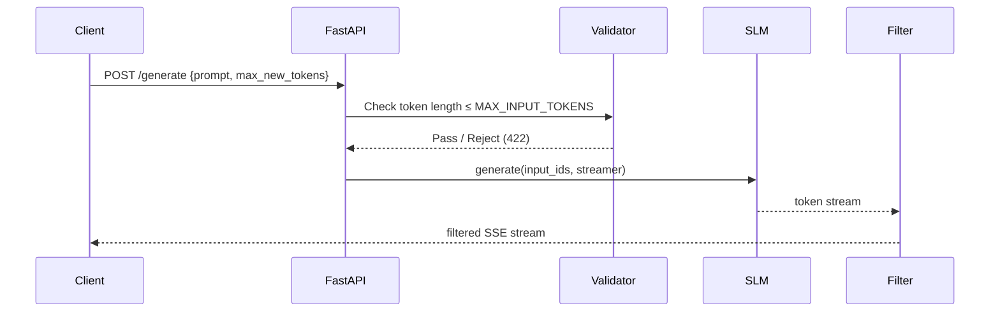

# Serving a Fine-Tuned SLM: API Endpoints and Inference Pipelines

[](https://colab.research.google.com/github/vinod-seth/slm-development/blob/main/tutorial/05_optimization_and_deployment/02_serving_a_fine_tuned_slm.ipynb)

| | |
|---|---|
| **Domain** | GenAI |
| **Module** | Optimization and Deployment |
| **Difficulty** | Beginner |
| **Estimated Time** | 35 minutes |
| **Prerequisites** | Basic Python programming knowledge; familiarity with training vs. <abbr title="Running a trained model to generate predictions or text output from new, unseen inputs.">inference</abbr> concepts; Module 4 (<abbr title="Low-Rank Adaptation: an efficient fine-tuning method that freezes base model weights and injects small trainable adapter matrices.">LoRA</abbr> <abbr title="Adapting a pre-trained model to a specific task by training it further on a smaller, targeted dataset.">Fine-Tuning</abbr>) completed; Python 3.11 + CUDA 12.1 environment active |

---

## Lesson Roadmap

- **🟢 Core Concepts** — Understand how a model becomes a web service: the request lifecycle, streaming, and why input validation matters at the API layer.
- **🔷 Technical Deep-Dive** — Build a FastAPI inference server that loads a quantized <abbr title="Small Language Model: a compact language model (under ~3B parameters) that can run on consumer hardware.">SLM</abbr>, streams tokens, enforces input limits, and filters outputs.
- **📊 Metrics Section** — Instrument time-to-first-token (TTFT) and tokens-per-second (TPS) with minimal overhead.
- **☁️ Hub Publishing** — Push your adapter and model card to the Hugging Face Hub.
- **🧪 Hands-On Exercise** — Run the server locally, call it with `curl`, and record your latency numbers.

---

## Learning Objectives

By the end of this lesson, you will be able to:

- Build a FastAPI inference endpoint that loads a quantized SLM and returns streamed responses.
- Configure input length limits and basic output content filtering as production baselines.
- Measure time-to-first-token and tokens-per-second for a served SLM.
- Push a fine-tuned adapter to the Hugging Face Hub with a complete model card.

---

## 🟢 Core Concepts

### From Notebook to Network Service

A fine-tuned model sitting in a Jupyter notebook helps no one in production. Turning it into a service means wrapping the model with a web framework that accepts HTTP requests, runs inference, and returns a response — all without crashing under real-world conditions.

Think of the serving layer as a post office sorting facility. Each incoming request is a parcel. The facility checks whether the parcel is within size limits (input length validation), routes it to the correct processing station (the model), and delivers the output to the recipient. If a parcel is oversized or contains prohibited contents, it is rejected before processing begins — not after.



### Streaming vs. Batch Responses

Batch responses wait for the model to finish generating all tokens, then return the full text. This adds perceived latency — the user stares at a blank screen.

Streaming responses push each token (or small token chunk) to the client as soon as it is produced. The user sees text appear progressively, which dramatically improves the feel of the application even when total generation time is identical.

FastAPI's `StreamingResponse` combined with Hugging Face's `TextIteratorStreamer` makes this straightforward.

### Security Baseline: Two Non-Negotiable Controls

> [!IMPORTANT]
> Fine-tuning does **not** make a model safe. A fine-tuned SLM can still reproduce harmful content if prompted adversarially. Treat safety controls at the API layer as a mandatory baseline, not optional polish.

Two controls every production endpoint needs from day one:

1. **Input length validation** — Reject prompts that exceed a token budget before they reach the model. Oversized inputs inflate compute cost and can expose padding-related vulnerabilities.
2. **Output content filtering** — Screen generated text against a blocklist or a lightweight classifier before it reaches the client. This is a coarse net, not a guarantee, but it raises the cost of abuse significantly.

Neither control is sufficient alone. They are your first line of defense while you build out a fuller safety pipeline.

### Key Metrics: TTFT and TPS

Two numbers define the user experience of a served SLM:

| Metric | Definition | Target (edge SLM, <abbr title="Central Processing Unit: the general-purpose processor in a computer.">CPU</abbr>) |
|---|---|---|
| **TTFT** (time-to-first-token) | Wall-clock seconds from request receipt to first token emitted | < 2 s |
| **TPS** (tokens per second) | Total generated tokens ÷ total generation time | > 8 tok/s |

Both degrade with longer context, <abbr title="The process of reducing weight precision (e.g. from 16-bit to 4-bit) to shrink model size and speed up inference.">quantization</abbr> trade-offs, and concurrent requests. Measure them before you optimize.

---

## 🔷 Technical Deep-Dive

### Environment Setup

```bash
pip install "fastapi==0.111.0" "uvicorn[standard]==0.29.0" \
            "transformers==4.41.2" "peft==0.11.1" \
            "bitsandbytes==0.43.1" "accelerate==0.30.1" \
            "huggingface_hub==0.23.2"
# Last verified: 2025-05
```

> [!NOTE]
> If you are running on CPU only, remove `bitsandbytes` and set `load_in_4bit=False` in the loader below. Expect TTFT of 5–15 s on modern laptop hardware.

### Project Layout

```
slm_server/
├── main.py            # FastAPI application
├── model_loader.py    # Model + tokenizer initialization
├── safety.py          # Input validation + output filtering
├── metrics.py         # TTFT / TPS instrumentation
└── .env               # HF_TOKEN (never committed)
```

### `model_loader.py` — Load a Quantized SLM with a LoRA Adapter

```python
"""
model_loader.py
Loads a 4-bit quantized base model and merges a LoRA adapter at startup.
Designed for SmolLM2-135M-Instruct or any PEFT-compatible SLM.
"""

from __future__ import annotations

import os
from pathlib import Path

import torch
from peft import PeftModel
from transformers import (
    AutoModelForCausalLM,
    AutoTokenizer,
    BitsAndBytesConfig,
)


# ---------------------------------------------------------------------------
# Configuration — read from environment, never hardcode credentials
# ---------------------------------------------------------------------------
BASE_MODEL_ID: str = os.environ.get(
    "BASE_MODEL_ID", "HuggingFaceTB/SmolLM2-135M-Instruct"
)
ADAPTER_PATH: str = os.environ.get(
    "ADAPTER_PATH", "./my_adapter"          # local path or HF repo id
)
DEVICE: str = "cuda" if torch.cuda.is_available() else "cpu"


def build_bnb_config() -> BitsAndBytesConfig | None:
    """Return a 4-bit quantization config when CUDA is available."""
    if DEVICE == "cpu":
        return None
    return BitsAndBytesConfig(
        load_in_4bit=True,
        bnb_4bit_compute_dtype=torch.float16,
        bnb_4bit_use_double_quant=True,
        bnb_4bit_quant_type="nf4",
    )


def load_model_and_tokenizer() -> tuple[torch.nn.Module, AutoTokenizer]:
    """
    Load the quantized base model, attach the LoRA adapter, and
    return both model and tokenizer ready for inference.
    """
    bnb_config = build_bnb_config()

    tokenizer = AutoTokenizer.from_pretrained(BASE_MODEL_ID)
    tokenizer.pad_token = tokenizer.eos_token  # required for batch padding

    model = AutoModelForCausalLM.from_pretrained(
        BASE_MODEL_ID,
        quantization_config=bnb_config,
        device_map="auto",
        torch_dtype=torch.float16 if DEVICE == "cuda" else torch.float32,
        trust_remote_code=False,
    )

    # Attach the LoRA adapter — keeps base weights frozen
    adapter_source = Path(ADAPTER_PATH)
    if adapter_source.exists():
        model = PeftModel.from_pretrained(model, str(adapter_source))
    else:
        # Treat as a Hub repo id
        model = PeftModel.from_pretrained(model, ADAPTER_PATH)

    model.eval()
    return model, tokenizer
```

### `safety.py` — Input Validation and Output Filtering

```python
"""
safety.py
Provides two baseline safety controls:
  1. Input token-length enforcement
  2. Keyword-based output content filtering

These are first-line controls only — not a complete safety solution.
"""

from __future__ import annotations

import re
from typing import Generator

from fastapi import HTTPException
from transformers import PreTrainedTokenizerBase


MAX_INPUT_TOKENS: int = 512   # Adjust based on model context window
MAX_OUTPUT_TOKENS: int = 256  # Hard cap on generation length

# Extend this set with domain-specific blocklist entries
_BLOCKED_PATTERNS: frozenset[re.Pattern[str]] = frozenset(
    re.compile(pattern, re.IGNORECASE)
    for pattern in [
        r"\b(bomb|explosive)\s+instructions?\b",
        r"\bsynthesi[sz]e\s+(drugs?|narcotics?)\b",
    ]
)


def validate_input_length(
    prompt: str,
    tokenizer: PreTrainedTokenizerBase,
) -> list[int]:
    """
    Tokenize the prompt and raise HTTP 422 if it exceeds MAX_INPUT_TOKENS.
    Returns the token id list so the caller avoids re-tokenizing.
    """
    token_ids: list[int] = tokenizer.encode(prompt, add_special_tokens=True)
    if len(token_ids) > MAX_INPUT_TOKENS:
        raise HTTPException(
            status_code=422,
            detail=(
                f"Prompt exceeds maximum input length of {MAX_INPUT_TOKENS} "
                f"tokens (received {len(token_ids)})."
            ),
        )
    return token_ids


def filter_output_token(token_text: str) -> str:
    """
    Screen a single decoded token against the blocklist.
    Replaces matched content with a placeholder.
    This function is called per-token during streaming.
    """
    for pattern in _BLOCKED_PATTERNS:
        if pattern.search(token_text):
            return "[content removed]"
    return token_text


def filtered_token_stream(
    raw_stream: Generator[str, None, None],
) -> Generator[str, None, None]:
    """Wrap a raw token generator with per-token output filtering."""
    for token_text in raw_stream:
        yield filter_output_token(token_text)
```

### `metrics.py` — TTFT and TPS Instrumentation

```python
"""
metrics.py
Lightweight inference metrics: time-to-first-token and tokens-per-second.
No external dependency required — uses standard library time module only.
"""

from __future__ import annotations

import time
from dataclasses import dataclass, field
from typing import Generator


@dataclass
class InferenceTimer:
    """Tracks TTFT and TPS for a single generation call."""

    _start: float = field(default_factory=time.perf_counter, init=False)
    _first_token_time: float | None = field(default=None, init=False)
    _token_count: int = field(default=0, init=False)
    _end: float | None = field(default=None, init=False)

    def record_token(self) -> None:
        now = time.perf_counter()
        if self._first_token_time is None:
            self._first_token_time = now
        self._token_count += 1

    def stop(self) -> None:
        self._end = time.perf_counter()

    @property
    def ttft_seconds(self) -> float | None:
        if self._first_token_time is None:
            return None
        return round(self._first_token_time - self._start, 4)

    @property
    def tokens_per_second(self) -> float | None:
        if self._end is None or self._first_token_time is None:
            return None
        duration = self._end - self._first_token_time
        if duration <= 0:
            return None
        return round(self._token_count / duration, 2)


def instrumented_stream(
    raw_stream: Generator[str, None, None],
    timer: InferenceTimer,
) -> Generator[str, None, None]:
    """Wrap a token stream to record timing without blocking the generator."""
    for token_text in raw_stream:
        timer.record_token()
        yield token_text
    timer.stop()
```

### `main.py` — FastAPI Inference Server with Streaming

```python
"""
main.py
FastAPI inference server for a fine-tuned SLM.

Run locally:
    uvicorn main:app --host 0.0.0.0 --port 8080 --reload

Environment variables required:
    BASE_MODEL_ID   — HF model id or local path
    ADAPTER_PATH    — local directory or HF Hub repo id of the LoRA adapter
    HF_TOKEN        — Hugging Face token (read from .env, never hardcoded)
"""

from __future__ import annotations

import os
from contextlib import asynccontextmanager
from typing import AsyncGenerator

import torch
from dotenv import load_dotenv
from fastapi import FastAPI, Request
from fastapi.responses import StreamingResponse
from pydantic import BaseModel, Field
from transformers import TextIteratorStreamer
from threading import Thread

from model_loader import load_model_and_tokenizer
from metrics import InferenceTimer, instrumented_stream
from safety import (
    MAX_OUTPUT_TOKENS,
    filter_output_token,
    filtered_token_stream,
    validate_input_length,
)

load_dotenv()  # reads .env — keep HF_TOKEN out of source control

# ---------------------------------------------------------------------------
# Application state — model loaded once at startup
# ---------------------------------------------------------------------------
app_state: dict = {}


@asynccontextmanager
async def lifespan(app: FastAPI) -> AsyncGenerator[None, None]:
    model, tokenizer = load_model_and_tokenizer()
    app_state["model"] = model
    app_state["tokenizer"] = tokenizer
    yield
    app_state.clear()


app = FastAPI(
    title="SLM Inference API",
    version="1.0.0",
    lifespan=lifespan,
)


# ---------------------------------------------------------------------------
# Request / Response schemas
# ---------------------------------------------------------------------------
class GenerationRequest(BaseModel):
    prompt: str = Field(..., min_length=1, max_length=4096)
    max_new_tokens: int = Field(
        default=128,
        ge=1,
        le=MAX_OUTPUT_TOKENS,
        description="Number of tokens to generate. Hard-capped at MAX_OUTPUT_TOKENS.",
    )
    temperature: float = Field(default=0.7, ge=0.0, le=2.0)


# ---------------------------------------------------------------------------
# Inference endpoint
# ---------------------------------------------------------------------------
@app.post("/generate")
async def generate_text(request: GenerationRequest) -> StreamingResponse:
    """
    Accept a prompt, validate it, run the SLM, and stream filtered tokens.
    Returns Server-Sent Events (text/event-stream).
    """
    model = app_state["model"]
    tokenizer = app_state["tokenizer"]

    # --- Input validation (raises HTTP 422 on failure) ---
    token_ids = validate_input_length(request.prompt, tokenizer)

    input_tensor = torch.tensor([token_ids]).to(model.device)

    # --- Streamer setup ---
    streamer = TextIteratorStreamer(
        tokenizer,
        skip_prompt=True,
        skip_special_tokens=True,
    )

    generation_kwargs = {
        "input_ids": input_tensor,
        "max_new_tokens": request.max_new_tokens,
        "temperature": request.temperature,
        "do_sample": request.temperature > 0.0,
        "streamer": streamer,
    }

    # Run generation in a background thread so FastAPI event loop stays free
    thread = Thread(target=model.generate, kwargs=generation_kwargs)

    timer = InferenceTimer()

    async def token_event_generator() -> AsyncGenerator[str, None]:
        thread.start()
        for filtered_token in filtered_token_stream(
            instrumented_stream(streamer, timer)
        ):
            yield f"data: {filtered_token}\n\n"
        thread.join()
        # Emit metrics as a final SSE comment so clients can log them
        yield (
            f": ttft={timer.ttft_seconds}s "
            f"tps={timer.tokens_per_second}\n\n"
        )

    return StreamingResponse(
        token_event_generator(),
        media_type="text/event-stream",
    )


@app.get("/health")
async def health_check() -> dict[str, str]:
    return {"status": "ok", "model": os.environ.get("BASE_MODEL_ID", "unknown")}
```

### Push Your Adapter and Model Card to the Hub

```python
"""
push_to_hub.py
Publishes a fine-tuned LoRA adapter and a structured model card to HF Hub.
Run once after training is complete and validated.
"""

from __future__ import annotations

import os

from huggingface_hub import HfApi, ModelCard, ModelCardData
from peft import PeftModel
from transformers import AutoTokenizer


HF_TOKEN: str = os.environ["HF_TOKEN"]          # set in shell, never hardcode
ADAPTER_LOCAL_PATH: str = "./my_adapter"
HUB_REPO_ID: str = os.environ["HUB_REPO_ID"]    # e.g. "yourname/smollm2-finetuned"
BASE_MODEL_ID: str = os.environ.get(
    "BASE_MODEL_ID", "HuggingFaceTB/SmolLM2-135M-Instruct"
)

api = HfApi(token=HF_TOKEN)
api.create_repo(repo_id=HUB_REPO_ID, exist_ok=True)

# --- Push the adapter weights ---
tokenizer = AutoTokenizer.from_pretrained(BASE_MODEL_ID)
tokenizer.push_to_hub(HUB_REPO_ID, token=HF_TOKEN)

# PeftModel.push_to_hub uploads adapter_config.json + adapter_model.safetensors
from peft import PeftConfig
peft_config = PeftConfig.from_pretrained(ADAPTER_LOCAL_PATH)
api.upload_folder(
    folder_path=ADAPTER_LOCAL_PATH,
    repo_id=HUB_REPO_ID,
    token=HF_TOKEN,
)

# --- Author a structured model card ---
card_data = ModelCardData(
    language=["en"],
    license="apache-2.0",
    base_model=BASE_MODEL_ID,
    tags=["peft", "lora", "slm", "text-generation"],
    datasets=["your-dataset-id"],   # replace with actual dataset
)

card_content = f"""
---
{card_data.to_yaml()}
---

# {HUB_REPO_ID}

Fine-tuned LoRA adapter on top of [{BASE_MODEL_ID}](https://huggingface.co/{BASE_MODEL_ID}).

## Intended Use
Describe the specific task this model was fine-tuned for and the target user group.

## Training Details
- **Base model:** {BASE_MODEL_ID}
- **PEFT method:** LoRA (r=8, alpha=16)
- **Training dataset:** Replace with dataset name and size
- **Hardware:** Replace with GPU/CPU used and training time

## Evaluation Results
| Metric | Value |
|---|---|
| ROUGE-L | 0.XX |
| Eval loss | 0.XX |

## Limitations and Bias
This model inherits biases from its base model and training data.
Users should apply output filtering and human review for high-stakes applications.
Fine-tuning and system prompts are **soft controls**, not security guarantees.
Adversarial inputs may still elicit harmful outputs.

## How to Use
```python
from peft import PeftModel
from transformers import AutoModelForCausalLM, AutoTokenizer

tokenizer = AutoTokenizer.from_pretrained("{HUB_REPO_ID}")
base = AutoModelForCausalLM.from_pretrained("{BASE_MODEL_ID}")
model = PeftModel.from_pretrained(base, "{HUB_REPO_ID}")
```

## Last Verified
2025-05
"""

ModelCard(card_content).push_to_hub(HUB_REPO_ID, token=HF_TOKEN)
print(f"Adapter and model card published to https://huggingface.co/{HUB_REPO_ID}")
```

> [!IMPORTANT]
> The model card's **Limitations and Bias** section is required for responsible publishing — not optional boilerplate. It signals to downstream users that safety review is still needed.

---

## Hands-On Exercise

**Goal:** Run the inference server locally and record your TTFT and TPS numbers.

### Step 1 — Set environment variables

```bash
export BASE_MODEL_ID="HuggingFaceTB/SmolLM2-135M-Instruct"
export ADAPTER_PATH="./my_adapter"   # or omit if you have no adapter yet
export HF_TOKEN="hf_..."            # your HF read token
```

### Step 2 — Start the server

```bash
cd slm_server/
uvicorn main:app --host 0.0.0.0 --port 8080
```

You should see:

```
INFO:     Application startup complete.
INFO:     Uvicorn running on http://0.0.0.0:8080
```

### Step 3 — Send a streaming request

```bash
curl -N -X POST http://localhost:8080/generate \
  -H "Content-Type: application/json" \
  -d '{"prompt": "Explain what a neural network is in two sentences.", "max_new_tokens": 64}'
```

You will see tokens appear one by one. The final line starts with `: ttft=` — this is your TTFT in seconds.

### Step 4 — Test the input length guard

```bash
# Generate a prompt over 512 tokens and confirm HTTP 422 is returned
python - <<'EOF'
import httpx, json
long_prompt = "word " * 600
resp = httpx.post(
    "http://localhost:8080/generate",
    json={"prompt": long_prompt, "max_new_tokens": 32},
)
print(resp.status_code, resp.json())
EOF
```

Expected output: `422 {'detail': 'Prompt exceeds maximum input length of 512 tokens...'}`

### Step 5 — Record your results

Fill in this table in your notes:

| Run | Prompt tokens | Max new tokens | TTFT (s) | TPS |
|---|---|---|---|---|
| 1 | | | | |
| 2 | | | | |

**Verifiable outcome:** TTFT is logged, the 422 guard fires correctly, and tokens stream progressively instead of appearing all at once.

---

## 🟢 Concept Check

**Question 1**

Which HTTP status code should an inference endpoint return when the input prompt exceeds the configured token limit?

* [ ] 400 Bad Request
* [x] 422 Un